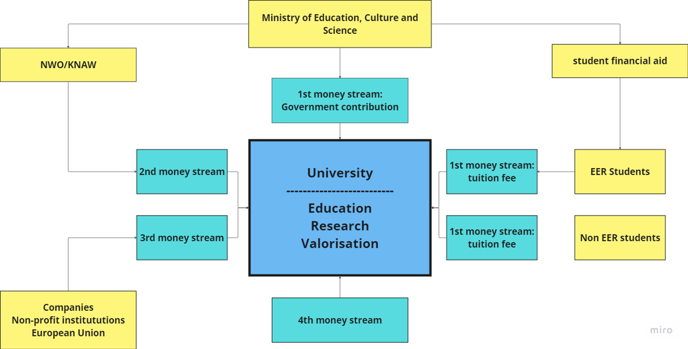
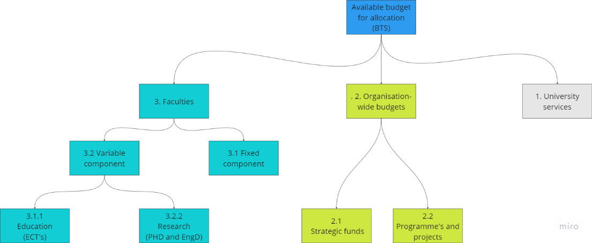

# Funding and Financial Distribution at TU Delft

### The Four Main Sources of University Income

University funding is categorised into four main streams: the first, second, third, and fourth.

•	**First Money Stream:** This consists of direct government contributions and tuition fees. For European students, part of the tuition fees is subsidised by the Dutch government.

•	**Second Money Stream:** These funds are also government-sourced, but come through organisations like NWO (Dutch Research Council) or KNAW (Royal Netherlands Academy of Arts and Sciences).

•	**Third Money Stream:** This includes funding from companies, non-profit organizations, and the European Union.

•	**Fourth Money Stream:** Refers to income outside traditional sources, such as donations or private gifts.

### Allocating the First Money Stream within TU Delft

The Ministry of Education, Culture and Science allocates a budget for all Dutch universities. TU Delft receives a share of this budget, which is divided into two components: a fixed portion and a variable portion. The variable component depends on factors such as the number of students, BSc and MSc degrees awarded, and PhD defenses. This system of fixed and variable components also comes back in the internal allocation of funds to faculties and departments.

Within TU Delft, the first money stream is distributed among three main bodies:
1.	**University Services:** These include services such as HR, Finance, and ICT.
2.	**Organisation-Wide Budgets:** These are used for strategic funds, programs, and projects aligned with the TU Delft agenda, as set by the Executive Board.
3.	**Faculties:** Each faculty receives a portion of the first money stream, which is then distributed among its departments, such as the Hydraulic Engineering department.

 