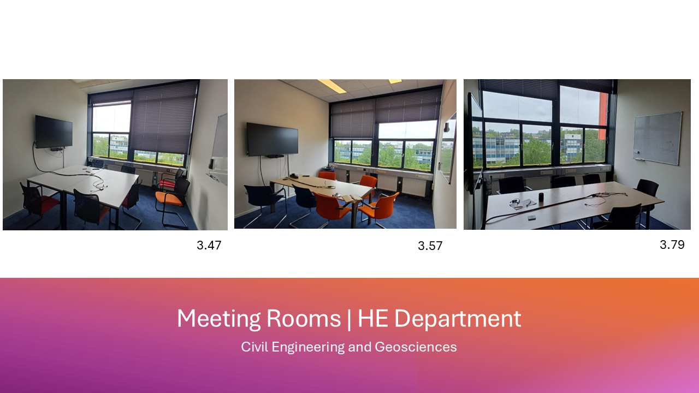

### Meeting Rooms

Available **meeting Rooms** on the third floor: 
- **3.47** (Bookings for up to 6 people, not a digital booking panel available)
- **3.57** (Booking for up to 7 people, whiteboards and monitor)
- **3.79** (Bookings for up to 7 people, white board, flip charts and monitor)
- **3.69** (Larger, board meeting room, 10-12 people, whiteboard and monitor)
 
 
**Additional meeting rooms:** 
For up to 4 people, smaller rooms next to lift D are available.
These rooms **3.80.6** and **3.82.6** can be booked for up to 4 people and are equipped with a monitor. These can be booked via the contacting the management assistants or MS Calendar.

**Meeting Rooms Bookings:**
- Booking of standard meeting rooms is possible by permanent employees in the following way:
   1. Click a slot on your calendar to create a new appointment.
   2. Click **Location**
   3. On the list that appears check for Room-23 that indicates the Building of Civil Engineering and Geosciences, and look for the following rooms:

      - For standard meeting rooms: **Room-23.HG.3.47; Room-23.HG.3.57; Room-23.HG.3.69; Room-23.HG.3.79;**
      - For smaller meeting rooms: **Vergaderruimte-3.80.6-CiTG; Vergaderruimte-3.82.6-CiTG;**
      
   5. Shortly after completing the request you will receive a confirmation email on your inbox. Not successful? Plesase try another room on the same hour, or alternatively try another timeslot.
- To book one of the **faculty meeting rooms** in the second floor, please direct your request to **secr-he-citg@tudelft.nl**
- To book a lecture room, please contact **roosters-citg@tudelft.nl.**

**Manual for booking:** https://d2k0ddhflgrk1i.cloudfront.net/Studentenportal/Centraal/ICT/Manuals/Email/Outlook_booking_a_meeting_room_Jun2022_ENG.pdf

**Manual for setting up outlook and calendar:** https://www.tudelft.nl/en/it-manuals/e-mail-and-calendar

In case there is a problem please contact your own management assistant.

