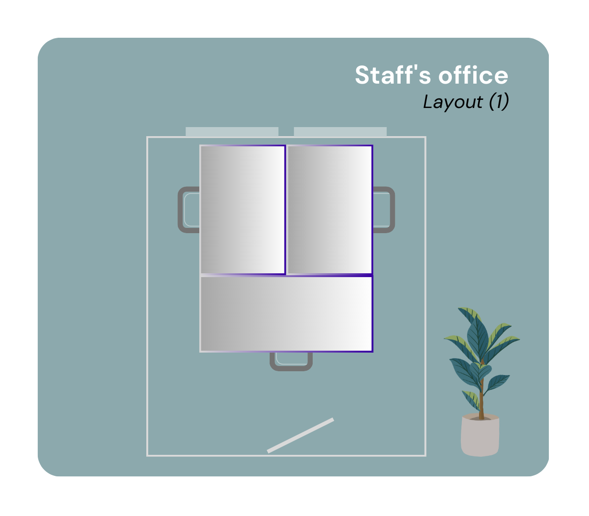

# Office Types

Types of offices within the HE Department for visiting and permanent staff:

- Flex Rooms: 3.38, 3.81 and 3.93
- PhD's / Postdoc's Offices ( 2  layouts)
- Standard office for permanent staff ( 4 layouts)
- Office for senior staff member (1 layout)
  
____________________________________________
  Additional Rooms:

  - Secretariat Room  3.73.1
  - HE Support Room 3.77.1
  - Management Assistants Room [tbc]
____________________________________________

The following layouts are available for permanent or temporary employees of the HE Department. 

|  |  |
|:-----------------------------------------------------------:|:------------------------------------------------------------:|
| **Staff Office Layout I**                                   | **Staff Office Layout II**                                   |

|  |  |
|:--------------------------------------------------------------:|:-------------------------------------------------------------:|
| **Staff Office Layout III**                                    | **Staff Office Layout IV**                                   |

|  |  |
|:--------------------------------------------------:|:---------------------------------------------------:|
| **PhD Office Layout I**                             | **PhD Office Layout II**                            |

|  |  |
|:---------------------------------------------------------------:|:---------------------------------------------------------------------:|
| **Flex Office Layout I**                                       | **Flex Office Layout II**                                            |

|  |  |
|:--------------------------------------------------------------------:|:-------------------------------------------------------------------------------:|
| **Senior Faculty Member Office**                                     | **HE Support Secretariat**                                                     |

