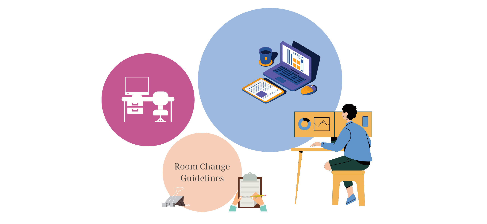

## Workspace Guidelines

### Steps to Request a Room Change

1. **Discuss with Section Leader:**
   - If you would like to change rooms or swap your workplace, please discuss this with your section head.

2. **Inform the Management Assistants:**
   - The Management Assistants will check the floor plan to see if a room is available.

3. **Arrangement by Management Assistants:**
   - The Management Assistant will arrange the move via Facility Management and update the room nameplate.

4. **Update Your Information:**
   - You will need to update your room information on [iam.tudelft.nl](https://www.tudelft.nl/en/e-service).

   For more information, please see this detailed [flowchart](./Appendices/Flowchart%20change%20room%20procedure.pdf).
   

### General Guidelines

#### Flex Rooms

- **Flex rooms 3.81 and 3.83:**
  - Each flex room has 6 workspaces equipped with docking stations and monitors.
  - Booking of flex rooms is not necessary.
  - You can store your personal belongings in locked cabinets.

- **PhD Students and Postdocs:**
  - Have their own desk.
  - Are allowed to work at home but will have a desk for their entire FTE (as long as their contract lasts).

- **Staff Members:**
  - Many staff members will spend only part of their working week in the office (working from home on a regular basis, appointments with 2nd employer, etc.).
  - If not in the office full-time, staff members are requested to indicate, in consultation with the department, which days they plan to work on-campus. This should cover at least 60% of their appointment.
  - During their on-campus days, each staff member (≥ 0.4 FTE) will have their own workplace (desk).
  - Only section leaders and full professors (≥ 0.8 FTE) have the option to request their own room. The available capacity determines if the request can be granted.
  - Part-time colleagues with limited time on-campus (≤0.3 FTE) can choose from several rooms with dedicated facilities for a flexible working environment.
  - Each workplace is available for use by other people on the days the staff member is not scheduled to be on campus.
 

