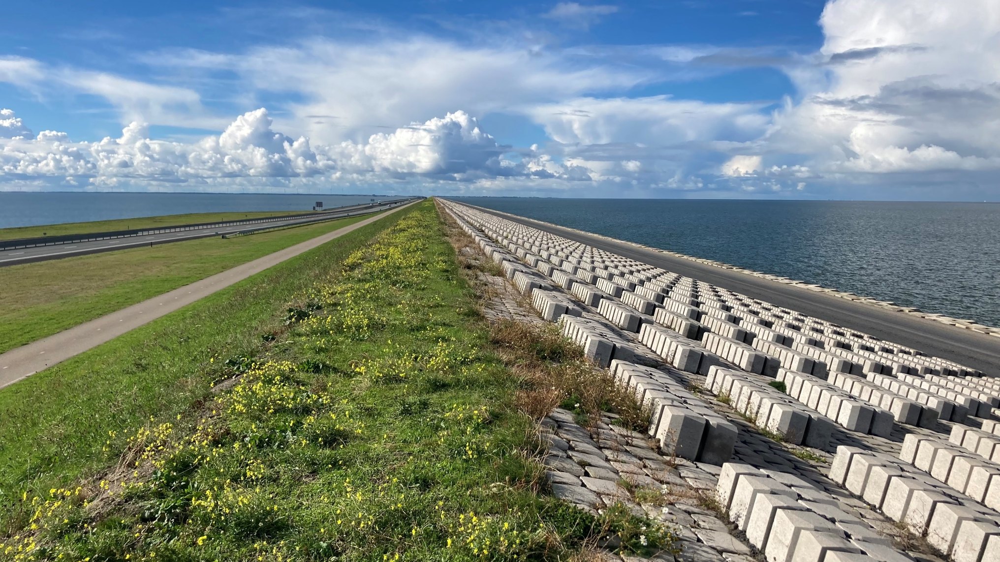

# General Department

On this page, you will find information about general matters concerning the Hydraulic Engineering Department.

Currently, the available content includes:
- An overview of MT (Management Team) decisions.
- HE staff meetings schedule and presentations.
- An archive of the weekly team updates.
- Floorplans of the department.
- Guidelines for workspaces within the HE Department.

