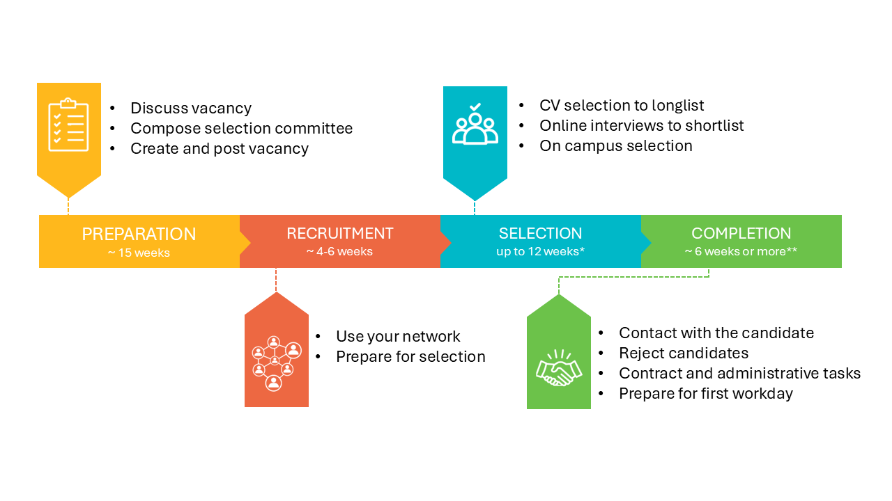

# Hiring a Lecturer or Assistant/Associate Professor

This procedure is a guide for the hiring of Lecturers, Assistant Professors (UD) and Associate Professors (UHD). 

How to use this? Follow the steps according to the image below. At the left of your screen you find all steps which you can follow consecutively. A [stepwise approach](../HigherFunctions/Appendices/8.%20Recruitment%20and%20selection%20procedure%20Professors.pdf) is available and can be used as an addition to this procedure. 

The procedure for promotion and hiring of full professors is not treated here. For the full professor procedure, you can contact the HR advisor and you can check [this link](https://intranet.tudelft.nl/-/recruitment-selection-and-internal-procedure-of-academic-staff?p_l_back_url=%2Fsearch%3Fq%3Dbenoemings)  

*We highly value your feedback! Please let us know when anything can be improved by sending an email to webmaster-wbk-citg@tudelft.nl*

