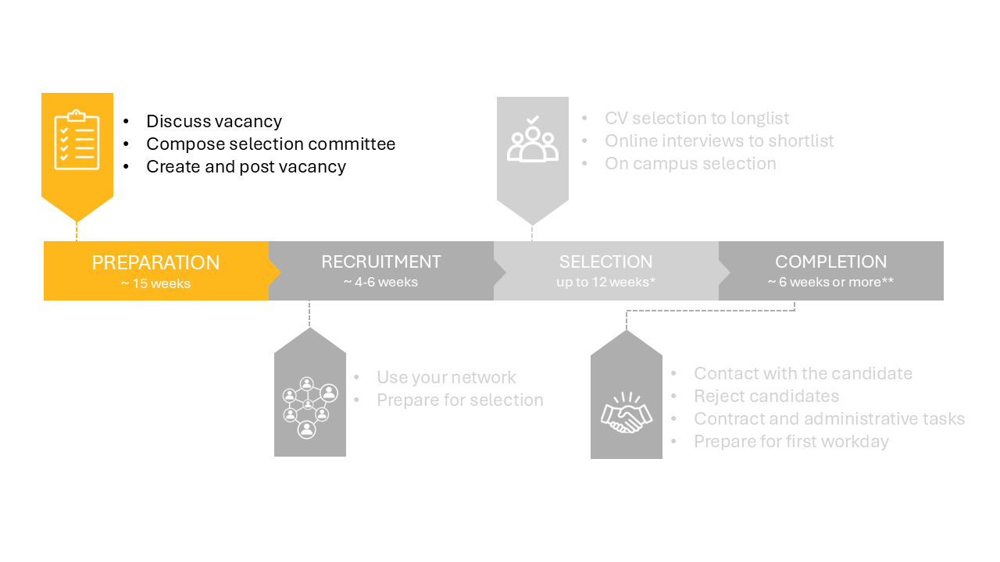

# 1 Preparation phase




The three substeps of this phase are really intertwined. Therefore, start by reading all three steps to get an idea of the dependencies. 

## 1.1 Discuss vacancy 

First, check the financial parameters and meet with the department secretary and the HR advisor to discuss the practicalities of the hiring process. 

Next, make a draft profile for the vacancy and discuss it with: 

- The department MT. They will provide feedback on the draft profile and vacancy. The department chair will ask the dean for permission. 

- The faculty MT. They will provide feedback on the draft profile and proposed composition of the selection committee, see also step 1.2 Compose committee. 

 

## 1.2 Compose selection committee 

Form the Appointments Advisory Committee (AAC) together with the department secretary and HR advisor. Please verify whether the department chair approves of this committee.

```{admonition} Who should be in the selection committee?
:class: tip, dropdown

The selection committee should consist of at least one woman and requires the following functions:

- Department chair of another department  

- Section leader (vacancy holder) of the relevant group  

- Department chair of the relevant department  

- Member of the Academic Career Committe (ACC) of another department  

- Full or associate professor from another section, same department  

- Full or associate professor of another department or faculty  

- Program director  

- Assistant professor from the same section (substantive secretary)  

- HR Advisor  

- Department Secretary (process secretary) 
```

Plan the selection day as soon as possible. These committees are rather large and planning a day can therefore be a challenging task. A reasonable moment to plan the selection day is 4 weeks after the closure date of the vacancy. The management assistant can help you with the planning of the selection day. 


## 1.3 Create and post vacancy

Create the vacancy by filling in the [vacancy format](../HigherFunctions/Appendices/Vacancy%20format%20ENG%20-%20October%202024.docx).


Some notes regarding the vacancy format:
* Contact the HR advisor and fill the format together. Discuss the UFO profile, the conditions of employment and the vacancy text.
* The vacancy text can be written using the vacancy writing guide. The guide and examples of vacancy texts are available [here](https://sharepoint.tudelft.nl/misc/medewerkersportaal/_layouts/15/start.aspx#/SitePages/HR%20Vacatureteksten.aspx). Please note: a vpn connection is required to access this link from outside the campus.
* Some extra tips regarding the requirements formulation and selection strategy can be found in [this document](../Hiring/Appendices/7%20Tips%20for%20crafting%20a%20Selection%20Strategy.pdf)
* Add the on campus interview dates in the text if you already succeeded in planning the on campus selection with the full committee. 
* The Talent Acquisition Specialist of the faculty is Avital Fishman. 
* The cash flow is 1 for direct employees and 2/3 for project employees. 
* The standard time for a vacancy posting to stay active is 4-6 weeks. Contact Dept-Chair-HE@tudelft.nl if you would like to deviate from this.  
* A reasonable start date will be six months from the moment you start the vacancy process. Please be aware that the visa arrangement and the safety check may take weeks for NON-EU candidates.


When the vacancy form is complete, you can send the vacancy form to the Department Secretary (E.H.Bakker@tudelft.nl) and the HR advisor (m.scheers-vanderhorst@tudelft.nl). The vacancy format will then be sent to recruitment (Recruitment-CITG@tudelft.nl) and the recruitment assistant will create the vacancy in the recruitmentsystem. You will receive an email to approve the vacancy.

After submitting your vacancy will appear on: 

- TU Delft’s internal (intranet) vacancy page 
- TU Delft’s external vacancy page 
- Academic Transfer and Euraxess
- TU Delft’s LinkedIn job page 