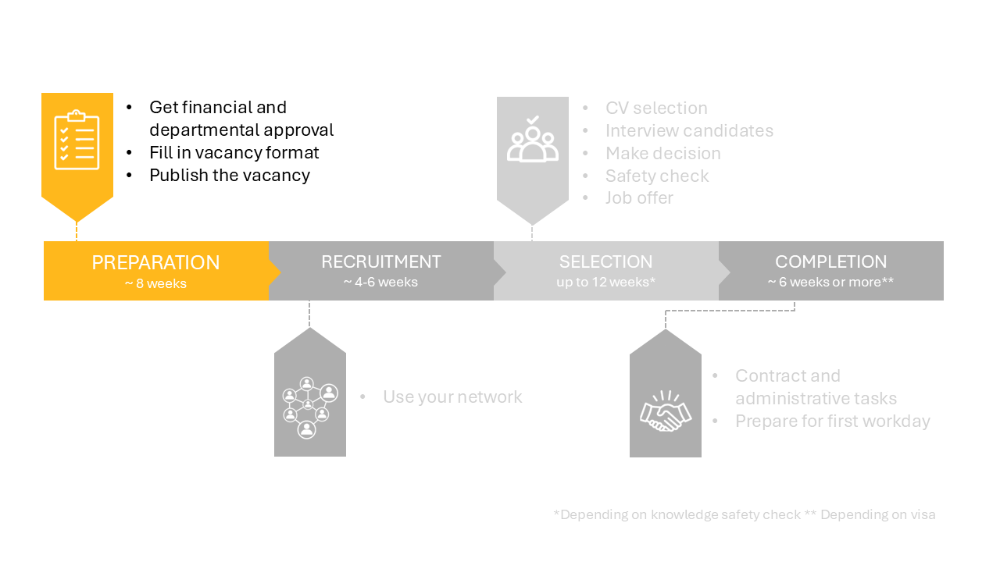

# 1 Preparation phase

## 1.1 Financial and departmenal checks 

Before posting a vacancy, the project procedure must be followed. If the project has approval and there is a _signed_ budget for the project, the recruitment process can be initiated. 

For first-time vacancy holders it is recommended to meet with the Department Secretary to discuss the practicalities of the hiring process.

## 1.2 Fill in vacancy format 

Use the vacancy format for [PhDs](./Appendices/Vacancy%20format%20ENG%20-%20October%202024%20format%20PHD.docx) or [PostDocs](./Appendices/Vacancy%20format%20ENG%20-%20October%202024%20format%20POSTDOC.docx) to gather the required information for the vacancy. As some have noted, the format does not handle comments well, so you can consider making and shaping the vacancy text in a separate word document first. 

Some notes regarding the vacancy format:
* Standard contract details apply for these positions and are already filled in.
<!-- * The Talent Acquisition Specialist of the faculty is Avital Fishman. 
* The cash flow is 1 for direct employees and 2/3 for project employees. -->
* The vacancy format has no room to formulate additional procedures (e.g. number of rounds or additional assignment), so if these are desired, they must be sent separately by email.
* The vacancy text can be written using the vacancy writing guide. The guide and examples of vacancy texts are available [here](https://sharepoint.tudelft.nl/misc/medewerkersportaal/_layouts/15/start.aspx#/SitePages/HR%20Vacatureteksten.aspx). Please note: a vpn connection is required to access this link from outside the campus.
* Some extra tips on formulating the requirements and using it in the selection strategy can be found in [this document](../PhDPostDocs/Appendices/7%20Tips%20for%20crafting%20a%20Selection%20Strategy.pdf) 
* The standard time for a vacancy posting to stay active is 4-6 weeks. Contact Dept-Chair-HE@tudelft.nl if you would like to deviate from this.  
* A reasonable start date will be six months from the moment you start the vacancy process. Please be aware that the visa arrangement and the safety check may take weeks for NON-EU candidates.

**Selection committee**

At this stage, it is advisable to establish the selection committee. A few requirements must be met regarding the composition of the committee:

* The committee consists of three TU Delft employees, up to two of which are directly involved in the project.
* At least one independent employee, preferably from a different section within the department.
* It is allowed to have up to one external party, which can serve as an advisory member of the committee.
* The decision is up to the three TU employees on the committee. Any external party fulfils an advisory role only.

The chosen selection committee is also filled in on the vacancy format. The validity of the selection committee will be checked by the department secretary once the vacancy format has been turned in.

## 1.3 Send vacancy format 

As soon as the financial check is done and the vacancy format is completed, you can send the vacancy form to secr-he-citg@tudelft.nl. The department secretary will check the vacancy and the vacancy format will then be sent to recruitment (Recruitment-CITG@tudelft.nl). The recruitment assistant will create the vacancy in the recruitmentsystem, after which you will receive an email to approve the vacancy.

After approval your vacancy will appear on: 

- TU Delft’s internal (intranet) vacancy page 
- TU Delft’s external vacancy page 
- Academic Transfer and Euraxess
- TU Delft’s LinkedIn job page 
