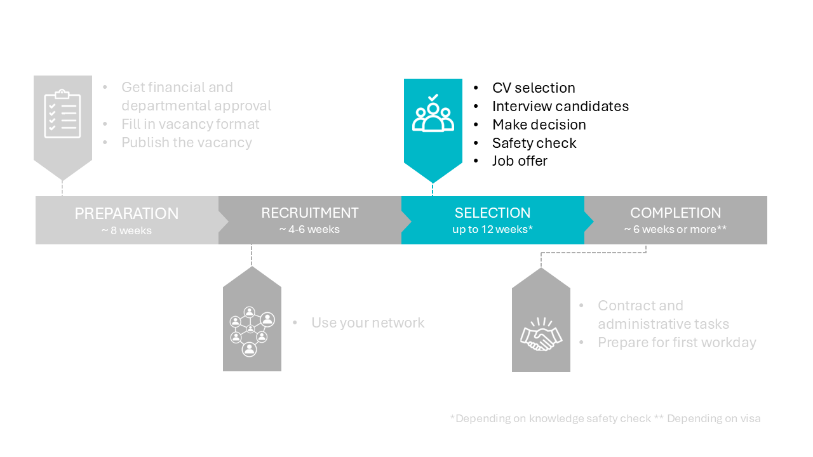

# 3 Selection phase




## 3.1 Selection steps 

The key stages of the selection process are as follows:

1. **The CV review in the recruitment system.** During this stage, candidates who do not meet the must-have qualifications are rejected. For the remaining candidates, you provide feedback and comments. It is advisable to discuss your evaluations and considerations with the selection committee. 

2. **Screening Interviews:** Conducting brief phone or video interviews can serve as a useful preliminary step before proceeding to formal job interviews.

3. **The full interviews.** Here you check the social and scientific fit of the candidates. 

4. **Candidate selection.** In this stage, you select the preferred candidate. In this stage you rate candidates based on the criteria you defined, and you make reference calls. 


Please use Chapter 3 of the 'PhD Recruitment and Selection Guide', which can be found on [this intranet page](https://intranet.tudelft.nl/-/posting-a-vacancy?p_l_back_url=%2Fsearch%3Fq%3Dhiring%2Band%2Bselection%2Bguide). Although this guide is written for PhD hiring, it is also very valuable to use for other functions. 

```{admonition} Knowledge safety check
:class: warning, dropdown
Be aware of the **knowledge safety check**! Candidates from or with connections to China, Russia, Belarus, Iran and North Korea should be checked. It is wise to start the knowledge safety check as soon as you have a shortlist of the 3-4 best candidates. How to do it? 

<!-- Send an email to HR with the candidate(s) name(s) to be checked and the number of the vacancy.HR will communicate with the safety knowledge department. HR will inform you about the outcome as soon as they have the result. -->

  * Send an email to the department secretary with the candidate(s) name(s) to be checked and the number of the vacancy.  
  * The department secretary will inform you about the results of the knowledge safety check.  
  * This check takes approximately 2 weeks and may in extreme cases take up to 10 weeks. 
  * Do not inform the candidates about the knowledge safety check as this information is confidential. 
```


Some important notes: 
* Regarding the selection committee: the selection is done using the four-eye principle. This requires at least one other person to participate in the selection, ensuring that decisions are impartial and free from bias. It is recommended to include a senior staff member as well as a neutral party who has no vested interest in the hiring decision.

* The selection process is done using **MyCareer**. Instructions can be found [on this intranet page](https://intranet.tudelft.nl/-/recruitment-system?p_l_back_url=%2Fsearch%3Fq%3Drecruitment). Use this system as much as possible and do not store CVs or send CVs by mail. 

* For a smooth selection process, it helps to plan the CV review and some potential interview moments soon in the agendas of the committee members.

* Contact the talent acquisition specialist (A.Fishman@tudelft.nl) or the HR advisor (m.scheers-vanderhorst@tudelft.nl) if no promising candidates have applied. 

* Please note: we aim to inform candidates about their application (rejection or invitation) within 2 weeks of the application deadline. Please finish the cv-review within those 2 weeks. The Management Assistants will then reject the candidates via the recruitment system and they can help you with planning the interviews.

* About the **job interviews**: 

  * The management assistants can help you planning the interviews.  
  * Using an [interview agenda](../PhDPostDocs/Appendices/Interview%20agenda%20-%20PhD%20Recruitment%20en%20Selection%20Guide%20V1%202023.05.docx) is recommended to treat all candidates the same. The interviews can also be split into [educational](../PhDPostDocs/Appendices/JobInterview_HelpingFiles/SPV%20Education%20Questionaire%20-%2020221220.%20-final.docx), 
  [leadership](../PhDPostDocs/Appendices/JobInterview_HelpingFiles/SPV%20Leadership%20questionaire%2020221220%20-%20final.docx) and [research](../PhDPostDocs/Appendices/JobInterview_HelpingFiles/SPV%20Research%20Questionaire%2020221220%20-%20final.docx) sections.


* Check the **English proficiency level (ETV)** of the candidates. An additional test is needed if PhD candidates are non-native speakers and have not followed their masters in English, see [this intranet page](https://intranet.tudelft.nl/en/-/english-language-skills-etv-for-phd-candidates?p_l_back_url=%2Fen%2Fgroup%2Fguest%2Fsearch%3Fq%3Detv) for PhD's and [this intranet page](https://intranet.tudelft.nl/en/-/itav-english-language-skills?p_l_back_url=%2Fen%2Fgroup%2Fguest%2Fsearch%3Fq%3Detv) for other scientific staff.


* Be aware that the process may take longer depending on the nationality of the candidate. The knowledge safety check usually takes 2 weeks and in extreme cases 10 weeks. Acquiring visa usually takes ~4 weeks for EU citizens and 12 weeks for non-EU citizens. 


**Rejecting candidates after interviews**

Once your preferred candidate has accepted the job offer, it is important to notify the remaining candidates. Candidates who were interviewed should be informed of the decision either by phone or in person. As the vacancy holder, this is your responsibility, and while it may be a challenging task, it is essential that these candidates are treated with respect and professionalism, acknowledging the time and effort they have invested in the application process.

Remember, every interaction with a candidate can influence TU Delft’s reputation as an employer, as well as the reputation of your research department. Careful handling of rejections contributes to maintaining a positive professional image.

**Note:** During the rejection conversation, do not reference the knowledge safety check. The outcome of this check is confidential and should not be shared with candidates. Instead, you can inform them that another candidate was deemed more suitable for the position.


```{admonition} Tips for rejection conversations
:class: tip, dropdown

When delivering bad news, please ensure you:  

* Do not postpone it. Get it done before the weekend whenever possible. The candidate will be expecting a follow-up and will feel disappointed if they haven’t heard from you. These candidates will share a bad experience with their peers. This could harm your reputation as an employer within the highly specific network you both operate in.  

* Be as clear as possible. A clear selection strategy will help you to explain why the candidate was not selected for the position. Vague and general feedback like “the other candidate performed better in the interview” or “the other candidate has more relevant experience” can stir strong negative emotions. 

* Stick to sharing actual observations and refrain from definitive conclusions about a candidate’s abilities. You don’t know a candidate’s true potential. Nevertheless, you do have to make a decision based on the impressions collected during the selection process. Don’t say “Your presentation skills are insufficient”. Do say: “During your presentation to the group we saw you struggling to answer questions. In addition, 4 out of the 5 people in the audience, couldn’t reproduce the core of your message.” 

More guidelines on delivering bad news in a positive way:  

1. Start with the announcement: “Hello Tristan, I am calling about your application to the position of PhD candidate. Is this a good time to talk?”  

2. Share the message. Be clear, factual and concise. This will reduce the likelihood of a candidate experiencing anger. For example: “Unfortunately, I have bad news. We have decided not to make you an offer for this position. The main reason is…..”  

3. Pause and listen. You may also ask the candidate “How does this makes you feel?” Don’t guess how the candidate feels. When an emotion is shared or visible, acknowledge it. “I can hear that you are disappointed/upset and I understand”.    

4. If a candidate feels sad or disappointed, this is a healthy part of the process of letting expectations go. Allow space for the candidate to regain their balance. Don’t disempower the candidate by feeling sorry for them.   

5. If a candidate feels angry, don’t take anything personally. Stay calm. Anger can be beneficial for the candidate, too. Don’t try to explain your reasoning during the peak of an emotion. Let the candidate know that you understand their reaction and allow them time to process. If a candidate is very upset, guard your boundaries. In this case, you can kindly end the conversation by stating that you will be in touch again the next day to answer any remaining questions. Always follow up on your promise.  

6. Once the peak of the emotion has passed, again offer your fact-based explanation and answer any questions. Don’t alter your initial explanation. Acknowledge any emotions. Sometimes, you will have to repeat your answer several times. 
```


## 3.2 Job offer 

Once you have selected your preferred candidate and the Knowledge Safety Check yields a positive result, you may proceed to inform the candidate and send a job offer. It is important not to decline your second-choice or "silver" candidate(s) until the job offer has been signed by the preferred candidate.  

First, you contact the candidate to share the positive news. Before doing so, ensure you have gathered the following key details:

* Details about the contract, such as duration, starting date, salary, working hours and contact details for follow-up questions. You can revisit the Vacancy Format for details and contact the HR advisor if any clarification is needed. It is advisable to avoid scheduling the first workday during a holiday period. However, if this cannot be avoided, ensure that support is available for the new employee during their first week.

* Verify the candidate's the English proficiency level (ETV). At this stage, it is strongly recommended to have either a good test result, an English masters degree or a native status by nationality. See also the intranet page [English language skills for PhD candidates](https://intranet.tudelft.nl/en/-/english-language-skills-etv-for-phd-candidates?p_l_back_url=%2Fen%2Fgroup%2Fguest%2Fsearch%3Fq%3Detv) or [English language skills for other scientific staff](https://intranet.tudelft.nl/en/-/itav-english-language-skills?p_l_back_url=%2Fen%2Fgroup%2Fguest%2Fsearch%3Fq%3Detv)

* If you are hiring an international candidate, provide the URL of the website of the Coming to Delft department and a brief introduction of their services.  

* If the candidate is a PhD hire, include an introduction to the Graduate School and the mentor programme.

* In addition, gather information regarding the subsequent steps in the process: the job offer, the contract, and the candidate's first workday. It is advisable to give the candidate an estimated timeline for these steps.


Afterwards, contact the management assistant to prepare the formal job offer. Additional information may be needed, for which they will contact you and the candidate. The job offer is checked by the department secretary and HR advisor before sending it.
