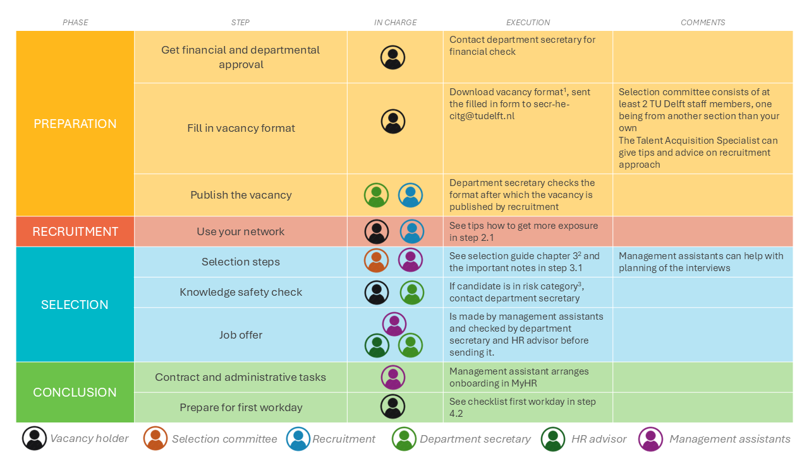

# Summary table

A summary of the steps to hire a PhD or PostDoc can be found in the table below.

1 The vacancy format is available for [PhDs](./Appendices/Vacancy%20format%20ENG%20-%20October%202024%20format%20PHD.docx) and [PostDocs](./Appendices/Vacancy%20format%20ENG%20-%20October%202024%20format%20POSTDOC.docx).

2 The ‘PhD Recruitment and Selection Guide’ can be found on [this intranet page](https://intranet.tudelft.nl/-/posting-a-vacancy?p_l_back_url=%2Fsearch%3Fq%3Dhiring%2Band%2Bselection%2Bguide).

3 Candidates from or with connections to China, Russia, Belarus, Iran and North Korea should be checked. It is wise to start the knowledge safety check as soon as you have a shortlist of the 3-4 best candidates.
