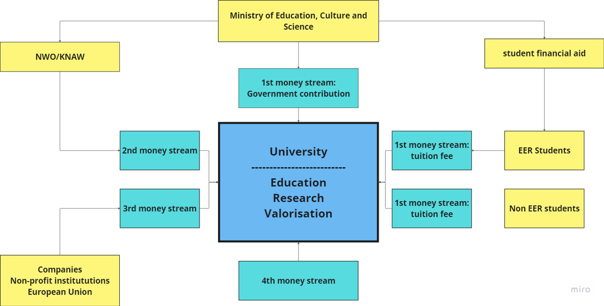
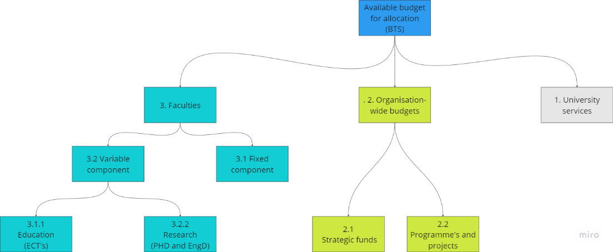

# Basics of Finance

This page tells the basics of the money streams within the university and the department. 

### University Financial Streams 

The money streams to the university are organised in first, second, third and fourth money streams.  

- The first money stream consists of a direct contribution from the government and tuition fees. The tuition fees of European (EER) students are partially paid by the government. 

- The second money stream comes from funds that are in the end paid by the government: the NWO or KNAW funds. 

- The third money stream comes from companies, non-profit institutions and the European Union.  

- The fourth money stream refers to money that a university receives outside of traditional money sources, e.g. donations. 

### Distribution of the first money stream 

The ministry of  Education, Culture and Science has a budget for all universities. TU Delfts receives a share of that budged based on a fixed component and a variable component. The variable component is dependent on the number of students, the number of BSc and MSc diplomas and the number of PhD defences. This division of a fixed and variable component is also used in the further division over the faculties and departments.

The first money stream is distributed over the TU Delft into three categories: 
- The university services like HR, finance and ICT.

- Organisation-wide budgets. Those budgets are about the TU Delft wide agenda as defined by the executive board. These budgets are used for strategic funds and programmes and projects.

- The faculties. Within each faculty this money is distributed over the departments, like the Hydraulic Engineering department.

 