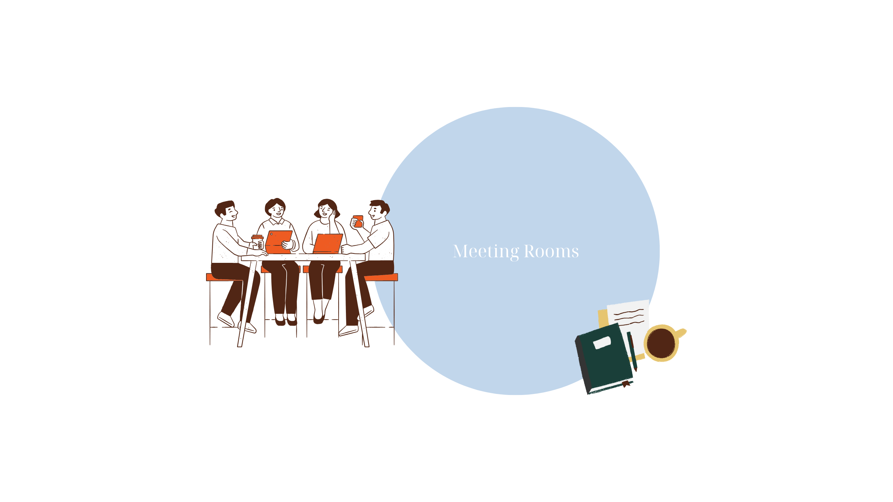

### Meeting Rooms

Available **Meeting Rooms** on the third floor: 
- 3.47 (Bookings for up to 6 people, not a digital booking panel available)
- 3.57 (Booking for up to 7 people, whiteboards and monitor)
- 3.79 (Bookings for up to 7 people, white board, flip charts and monitor)
- 3.69 (Larger, board meeting room, 10-12 people, whiteboard and monitor)

 
 
**Additional meeting rooms** For up to 4 people, smaller rooms next to lift D are available, noted as Exam room 1 & 2 in the floor plan.
- Rooms 3.80.6 and 3.82.6 can be booked for up to 4 people and are equiped with a monitor. These can be booked via the contacting the management assitantants or MS Calendar.

**Meeting Rooms Bookings:**
- Booking of standard meeting rooms is possible by permanent employees.
- To book one of the faculty meeting rooms in the second floor, please direct your request to **secr-he-citg@tudelft.nl**
- To book a lecture room, please contact roosters-citg@tudelft.nl

