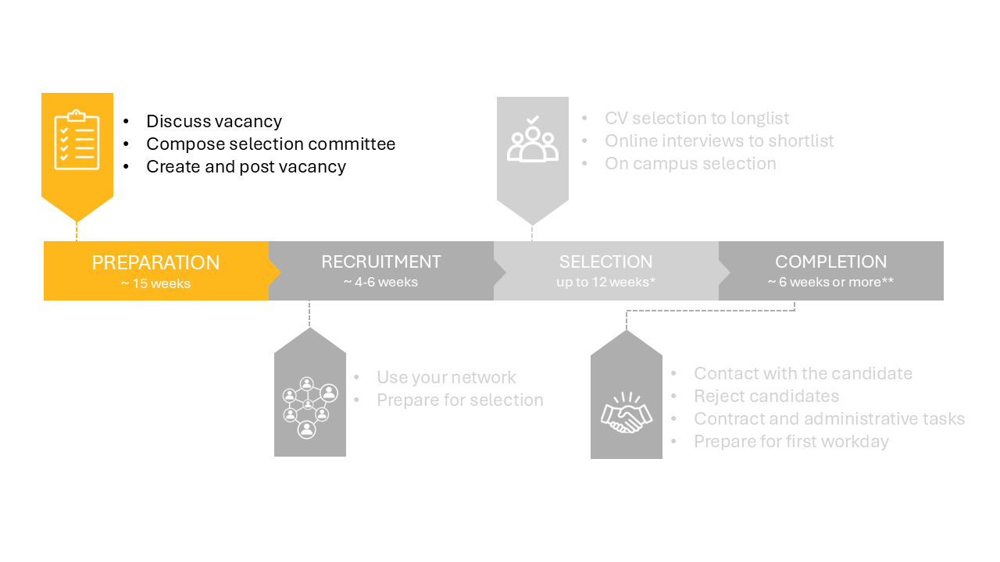

# 1 Preparation phase

The three substeps of this phase are really intertwined. Therefore, start by reading all three steps to get an idea of the dependencies. 

## 1.1 Discuss vacancy 

First, check the financial parameters and meet with the department secretary and the HR advisor to discuss the practicalities of the hiring process. 

Next, make a draft profile for the vacancy and discuss it with: 

- The department MT. They will give feedback on the draft profile and vacancy. The department chair will ask the dean for permission. 

- The faculty MT. They will give feedback on the draft profile and proposed composition of the selection committee, see also step 1.2 Compose committee. 

 

## 1.2 Compose selection committee 

Form the Appointments Advisory Committee (AAC) together with the department secretary and HR advisor. Check if the department chair agrees with this committee. 

The selection committee should consist at least one woman and requires the following functions: 

- Department chair of another department  

- Section leader (vacancy holder) of the relevant group  

- Department chair of the relevant department  

- Member of the Academic Career Committe (ACC) of another department  

- Full or associate professor from another section, same department  

- Full or associate professor of another department or faculty  

- Program director  

- Assistant professor from the same section (substantive secretary)  

- HR Advisor  

- Department Secretary (process secretary) 

Plan selection day 

These committees are rather large and planning the day of on campus interviews requires good planning. Start planning the selection day already in this stage as the availability of possible committee members is a considerable limiting factor. A reasonable moment will be 4 weeks after the closure date of the vacancy. The management assistant can help you with the planning of the selection day. 

## 1.3 Create and post vacancy

Create the vacancy by filling in the [vacancy format](../HigherFunctions/Appendices/1Preparation.PNG).

Some notes regarding the vacancy format:
* Contact the HR advisor (for academic career track/ higher functions) to discuss the UFO profile, the conditions of employment and the vacancy text. 
* The vacancy text can be written using the [vacancy writing guide](../Hiring/Appendices/Guide%20to%20creating%20recruitment%20text%20for%20scientific%20staff%20-%20Jan%202021.pdf) . As some have noted, the format does not handle comments well, so you can consider making and shaping the vacancy text in a separate word document first. Examples of vacancy texts can be found for Assistent and Associate professors 
[1](../HigherFunctions/Appendices/ExamplesVacancyTexts/Assistant%20Professor%20Biotechnology%20for%20Sustainable%20Food%20Security.docx)
[2](../HigherFunctions/Appendices/ExamplesVacancyTexts/Assistant-Associate%20Professor%20Complex%20Ship%20Design.docx)
[3](../HigherFunctions/Appendices/ExamplesVacancyTexts/Assistant%20Professor%20Electrification%20of%20Transportation.docx)
and Lecturers
[1](../HigherFunctions/Appendices/ExamplesVacancyTexts/Principal%20Educator%20-%20EN.docx)
[2](../HigherFunctions/Appendices/ExamplesVacancyTexts/Projectdocent%20werktuigbouwkunde%20(parttime).docx)
[3](../HigherFunctions/Appendices/ExamplesVacancyTexts/Principal%20Educator%20-%20EN.docx)
<!-- source (https://sharepoint.tudelft.nl/misc/medewerkersportaal/_layouts/15/start.aspx#/SitePages/HR%20Vacatureteksten.aspx)  -->
* Some extra tips regarding the requirements formulation and selection strategy can be found in [this document](../Hiring/Appendices/7%20Tips%20for%20crafting%20a%20Selection%20Strategy.pdf)
* Add the on campus interview dates if you already succeeded in planning the on campus selection with the full committee. 
* The Talent Acquisition Specialist of the faculty is Avital Fishman. 
* The cash flow is 1 for direct employees and 2/3 for project employees. 
* The standard time for a vacancy posting to stay active is 4-6 weeks. Contact Dept-Chair-HE@tudelft.nl if you would like to deviate from this.  
* A reasonable start date will be six months from the moment you start the vacancy process. Please be aware that the visa arrangement and the safety check may take weeks for NON-EU candidates.

When the vacancy form is complete, you can send the vacancy form to recruitment: Recruitment-CITG@tudelft.nl . Also communicate with recruitment about the type of appendices, such as: 

- Motivation and CV 
- List of publications 
- Research statement  
- Teaching statement 
- Names and contact of at least 3 referents outside the TU Delft 

After submitting your vacancy, it will appear on: 

- TU Delft’s internal (intranet) vacancy page 

- TU Delft’s external vacancy page 

- Academic Transfer 

- TU Delft’s LinkedIn job page 