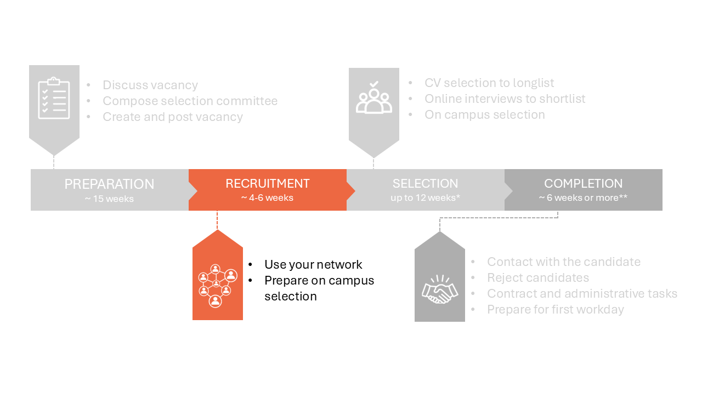
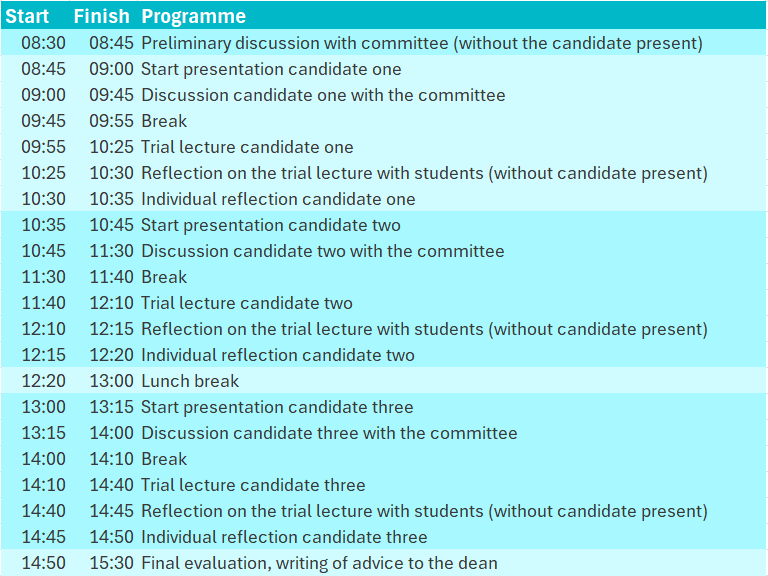

# 2 Recruitment phase



## 2.1 Use your network 

Your vacancy can now be found by job seekers who are actively looking for vacancies and using search terms matching your vacancy text on the specific platforms. This still excludes candidates such as:  

* Scientists not actively looking for a job outside of their existing network. 

* Job seekers who don’t have TU Delft on their radar. 

* Job seekers who don’t use LinkedIn or Academic Transfer. 


The so-called “post and pray” strategy is not always sufficient to attract the best candidate. We highly recommend that you always use your network to attract suitable candidates. 

**Use your network**

There are some relatively easy things you can do to boost the exposure and appeal of your vacancy. Invite suitable candidates you know through conferences, classes or collaborations to apply. Share the vacancy with your colleagues and ask people for names of potential candidates. Specify that you would appreciate people sharing the vacancy with possible candidates or send you the names of qualifying Master’s graduates. Take the lead in inviting people to apply. You can use both LinkedIn and the TU Delft intranet to find ways to contact these people.

Spread the word about the position when you visit (job) fairs and conferences or give presentations, share research posters or speak to people in your research area during (conference) lunches. Ask your direct colleagues to support you by providing a ready-made slide that they can include in their PowerPoint presentations or an informative banner to include in research posters.  

```{admonition} Using LinkedIn
:class: tip, dropdown

**Creating a LinkedIn account**

LinkedIn is an effective social media platform to use for recruitment purposes. If you don’t have a LinkedIn profile, we recommend you create one when you start recruiting. Including a profile picture, sharing your position and field of expertise and selecting TU Delft as your current employer will make you more successful as a recruiter on LinkedIn. Start inviting current and previous colleagues to activate your network of first-degree connections. Invite some of TU Delft’s talent acquisition specialists, as they have large and relevant networks. The magic of social media is that your reach will swiftly increase via your second-degree connections (the connections of your connections). All vacancies submitted for publication online are automatically posted on the TU Delft LinkedIn page. Boost the number of people who read your vacancy by sharing it as a post on your LinkedIn page. Your vacancy will then appear in the timeline, or the homepage, of everyone in your network. Subsequently, it will find its way to your 2nd-degree connections and beyond.  

**Post the vacancy on LinkedIn**

A step-by-step explanation on spreading a vacancy on your LinkedIn account can be found [here](../PhDPostDocs/Appendices/How%20to%20share%20a%20TUD%20vacancy%20on%20LinkedIn%20the%20right%20way.pdf) 

Where you are asked to add a personal note, please write 3 to 6 lines about:  

1. The challenge and impact of the position. 

2. The team or culture.  

3. And add a call to action such as: “Apply now or DM me for more information.” 

Don’t forget to respond to reactions. 
```

## 2.2 Prepare on campus selection 

Utilize the period during which the vacancy is open to thoroughly prepare for the selection phase.

The key steps of the selection process are: 

1. **CV screening:** This initial review is conducted by a subset of the selection committee, referred to as the "small committee." Candidates are categorized into three groups in Talentlink: accepted, rejected, or uncertain, resulting in a longlist of candidates.

2. **Online interviews:** If there are more than three strong candidates, online interviews should be conducted with the longlisted candidates. The small committee will narrow the list down to a maximum of three candidates, forming the shortlist.

3. **On-campus interviews:** This step involves the full selection committee and all shortlisted candidates are invited to the campus. This step results in an advice to the dean. 

The on-campus interviews require significant preparation. Follow the steps below in advance to ensure a smooth selection process.

**Plan the selection moment**

Ensure that the selection day is scheduled and blocked in the calendars of all committee members. Ideally, all activities should occur on the same day to ensure equal treatment of all candidates. However, you can consider having the final discussion on the next morning to give the selection committee some time to reflect. 

**Define the selection strategy**

During the selection day, the candidates have to give a presentation and a trial lecture and they are interviewed. Be aware that specific criteria for these positions have been established. Relevant documents can be found on the right-hand side of [this intranet page](https://intranet.tudelft.nl/-/performance-wp-criteria?p_l_back_url=%2Fsearch%3Fq%3Dwp%2Bcriteria) (set language to NL if the documents are not visible) 

Consider the composition of the committee for various parts of the day, as a large group (e.g., 12 people) may appear intimidating. For example, interviews could be split into three sessions, each focusing on [education](../HigherFunctions/Appendices/SeparatedInterviews/SPV%20Education%20Questionaire%20-%2020221220.%20-final%20(2).docx), [research](../HigherFunctions/Appendices/SeparatedInterviews/SPV%20Research%20Questionaire%2020221220%20-%20final%20(2).docx) and [valorisation/leadership](../HigherFunctions/Appendices/SeparatedInterviews/SPV%20Leadership%20questionaire%2020221220%20-%20final%20(1).docx), conducted by different subgroups of the committee.

Clarify the expectations for the candidate presentations and trial lectures. You can use part of the [invitation to the on campus interviews](../HigherFunctions/Appendices/ToCandidates_InvitationOnCampus.docx) for guidance. 

Prepare a standardized set of interview questions to ensure consistent treatment of all candidates. A sample set of interview questions can be found [here](../HigherFunctions/Appendices/3.%20%20ExampleQuestons_Interviews.pdf) 

Establish a method for evaluating candidates. An example scoresheet can be found [here](../HigherFunctions/Appendices/2.%20interview_scoresheet_ACT.docx). 

Discuss the overall selection strategy with some members of the selection committee. 

 

**Make a time schedule**

Draft a detailed schedule for the selection day. An example can be found below, along with [the original file](../HigherFunctions/Appendices/TimeTableSelectionDay.xlsx)



The selection day consists of the following parts: 

- **Preliminary discussion:** This should include at least the vacancy holder, selection committee chair, and department secretary (strongly recommended). Use this time to review the schedule, assess its feasibility, and clarify the chair's role.

- **Candidate presentations, trial lectures and interviews:** Each candidate will present and deliver a trial lecture, followed by interviews.

- **Final evaluation:** The committee will conduct a final evaluation, resulting in a recommendation to the dean. The dean may request further discussion and will either accept or reject the committee’s recommendation. Use the template [Advice to the Dean](../HigherFunctions/Appendices/ToDean_AdviceOfCommittee.docx) for this stage.

Do not forget the practical arrangements: 

- Ask the management assistant to reserve two rooms close to each other for that day. In one room, the selection committee will come together and discuss the candidates. In the other room, the candidate can prepare for the presentation without the whole committee in the room. 

- Ask the management assistant to arrange coffee and tea, and lunch if the selection process includes lunch. 

- Designate a host to greet candidates, ensuring a welcoming atmosphere that helps set candidates at ease.

 

**Inform the selection committee**

Ensure that the selection committee has access to Talentlink.

Inform the selection committee about the selection day. You can use this [template](../HigherFunctions/Appendices/ToSelectionCommittee_OnCampusSelection.docx) to organize the information towards the committee. Be sure to include the score sheet and interview questions. This information can be sent via email and added to the agenda by the management assistant.

 

**Inform students for the trial lectures**

Inform students about the trial lectures, ensuring sufficient attendance. You can send a message via Brightspace and mail by using [standardized message](../HigherFunctions/Appendices/ToStudents_TrialLectures.docx) provided. Additionally, the Waterbouwdispuut can assist in securing student participation. They can be contacted via Waterbouwdispuut-citg@tudelft.nl, and a sample email is available [here](../HigherFunctions/Appendices/ToWaterbouwDispuut_AskStudentsForTrialLectures.docxToWaterbouwDispuut). 

 

**Informing the candidates**

At this stage, you do not know who will be interviewed during the selection day. However, you can already prepare the invitation for the on campus interviews. An example invitation can be found [here](../HigherFunctions/Appendices/ToCandidates_InvitationOnCampus.docx). 

It is important to note that airplane and hotel costs will be covered for candidates residing outside the Netherlands. The management assistant can assist with these arrangements.
 