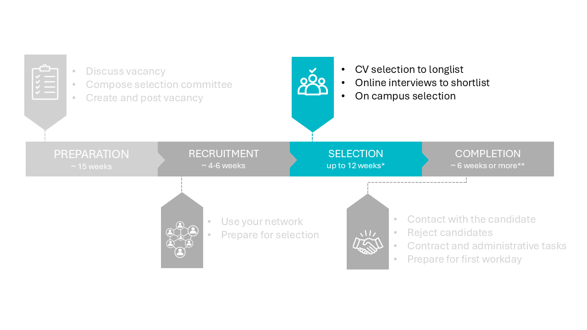

# 3 Selection phase




```{admonition} Knowledge safety check
:class: warning, dropdown

It is wise to start the knowledge safety check as soon as you have a shortlist of the 3-4 best candidates. Candidates from or with connections to China, Russia, Belarus, Iran and North Korea should be checked. How to do it? 

- Send an email to HR with the candidate(s) name(s) to be checked and the number of the vacancy. 

- HR will communicate with the safety knowledge department. HR will inform you about the outcome as soon as they have the result. 

- This check takes approximately 2 weeks and may in extreme cases take up to 10 weeks. 

- Do not inform the candidates about the knowledge safety check as this information is confidential. 
```

## 3.1 CV Selection to longlist 

The selection starts with the preselection, which is done by the committee chair and 2 other members of the selection committee. This subpart of the selection committee is also referred to as the small committee. Use talentlink to put all candidates into the categories invite, reject and doubt. This step results in a longlist of candidates. In the next step, you will interview those candidates online. 

If there are a large number of applicants, you will want to make a first selection based on a single, must-have criterion. Next, you can use your full scoring chart. Your checklist and scoring strategy for the CV review stage may look like the example below. Stick to the checklist and be aware of biased conclusions. For example, CV gaps are often not explained by applicants. The tendency might be to assume the negative and reject these candidates. However, there are many good reasons for CV gaps. 


Rejected candidates must be informed within 2 weeks after the application deadline. Email templates are available in the recruitment system and can be sent by the management assistants. After candidates have been interviewed, it’s best for the vacancy holder to send rejections by email or phone. Find guidelines and tips in paragraph 4.2. 

Before scheduling the interviews, you may choose to do a 15-20 minute screening by phone or video call. You will be surprised by some candidates and disappointed by others.  

 

## 3.2 Online interviews to shortlist 

This intermediate step is useful if you have more than 3 candidates left.  

Discuss with the small committee who the 4-5 best candidates are. Interview them online. You can use [this document](../HigherFunctions/Appendices/OnlineInterviewAgenda.docx) for a possible agenda.  

Also make reference calls. Guidelines for reference calls can be found [here](../HigherFunctions/Appendices/ReferenceCall_BasicGuidelines.docx) 

 

## 3.3 On campus selection 

The next step consists of the on campus interviews.  

Return to step *2.2 Prepare on campus selection* and check if you have done all those preparation steps. 

- Make sure that all selection committee members have the day in their agenda and have received all documents: the scoring chart, the planning of the day. Also have the [template for the advice to the dean](../HigherFunctions/Appendices/ToDean_AdviceOfCommittee.docx) ready. Print the documents if necessary. 

- Inform the candidates about the on campus interviews by using the mail you previously prepared. Also call the candidates whom you rejected after the online interviews if you have not done this already. Tips for rejection conversations can be found in section *4.2 Reject candidates*. 

- Make sure all rooms are booked, coffee and tea and lunch (if needed) is ordered, a host will welcome the candidates and there are students to attend the trial lectures. 

 

After the selection day you send your advice to the dean. You can continue with the next step if the dean has approved. 

 