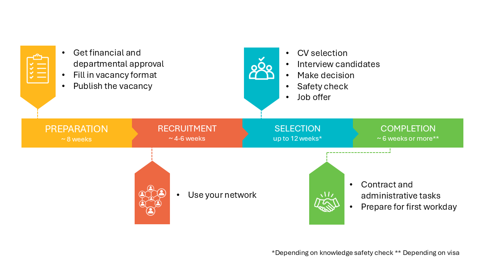

# Hiring a PhD or PostDoc

You have secured the necessary funding to initiate a new (sub)project. The next step is to ensure that the right candidate applies for your vacancy, and that you select the most suitable individual for your project. This webpage outlines the complete recruitment and selection process, designed to make the procedure both efficient and respectful to all participants.

How to use this? Follow the steps according to the image below. At the left of your screen you find all steps which you can follow consecutively.

<!-- **Note**: these steps are not applicable for hiring a student assistant. Student assistants are officially hired by FlexDelft. Contact someone who recently hired a TA for the current TA hiring process.  -->

*We highly value your feedback! Please let us know when anything can be improved by sending an email to webmaster-wbk-citg@tudelft.nl*