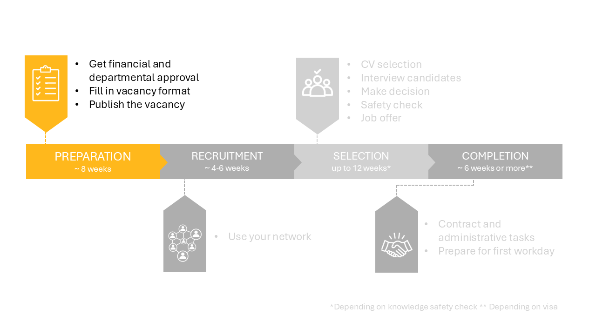

# 1 Preparation phase

## 1.1 Financial and departmenal checks 

Before posting a vacancy, the internal project budget must be approved. This applies to all project-funded vacancies (second or third cash flow).

For first-time vacancy holders it is recommended to meet with both the Department Secretary and the HR Advisor to discuss the practicalities of the hiring process.

Once the financial check is complete, you may proceed to the next step

## 1.2 Fill in vacancy format 

Use the [vacancy format](../PhDPostDocs/Appendices/Vacancy%20Format%201.7%20-%20ENG%20-%20Version%2017-05-2021.docx) to gather the required information for the vacancy.

Some notes regarding the vacancy format:
* Ask the department secretary to fill in part of the format, e.g. the UFO profile and the cash flow. 
<!-- * The Talent Acquisition Specialist of the faculty is Avital Fishman. 
* The cash flow is 1 for direct employees and 2/3 for project employees. -->
* The vacancy text can be written using the [vacancy writing guide](../PhDPostDocs/Appendices/Guide%20to%20creating%20recruitment%20text%20for%20scientific%20staff%20-%20Jan%202021.pdf) . As some have noted, the format does not handle comments well, so you can consider making and shaping the vacancy text in a separate word document first. Examples of vacancy texts are available for PhD functions 
[1](../PhDPostDocs/Appendices/ExamplesVacancyTexts/PhD%20Position%20Decentralised%20Machine%20Learning.docx)
[2](../PhDPostDocs/Appendices/ExamplesVacancyTexts/PhD%20Position%20Modelling%20of%20Regional%20Criminal%20Vulnerability%20and%20Supply%20Chains.docx)
[3](../PhDPostDocs/Appendices/ExamplesVacancyTexts/PhD%20Position%20Spread%20in%20Networks.docx)
[4](../PhDPostDocs/Appendices/ExamplesVacancyTexts/PhD%20Positions%20in%20Thermoplastic%20Composites.docx)
and for Postdoc functions
[1](../PhDPostDocs/Appendices/ExamplesVacancyTexts/Postdoc%20Damping%20of%20Critical%20Electrical%20Oscillatory%20Phenomena.docx)
[2](../PhDPostDocs/Appendices/ExamplesVacancyTexts/Postdoc%20Ethical%20Impact%20of%20Technology%20on%20Society.docx)
[3](../PhDPostDocs/Appendices/ExamplesVacancyTexts/Postdoc%20Partnerschap%20met%20omwonenden%20in%20bouwprocessen.docx)
<!-- source (https://sharepoint.tudelft.nl/misc/medewerkersportaal/_layouts/15/start.aspx#/SitePages/HR%20Vacatureteksten.aspx)  -->
* Some extra tips on formulating the requirements and using it in the selection strategy can be found in [this document](../PhDPostDocs/Appendices/7%20Tips%20for%20crafting%20a%20Selection%20Strategy.pdf) 
* The standard time for a vacancy posting to stay active is 4-6 weeks. Contact Dept-Chair-HE@tudelft.nl if you would like to deviate from this.  
* A reasonable start date will be six months from the moment you start the vacancy process. Please be aware that the visa arrangement and the safety check may take weeks for NON-EU candidates.

**Selection committee**

At this stage, it is advisable to establish the selection committee. For PhD and Postdoc positions, the four-eye principle is applied during the selection process. This requires at least one other person to participate in the selection, ensuring that decisions are impartial and free from bias. It is recommended to include a senior staff member as well as a neutral party who has no vested interest in the hiring decision.

## 1.3 Send vacancy format to recruitment 

As soon as the financial check is done and the vacancy format is completed, you can send the vacancy form to the Department Secretary (E.H.Bakker@tudelft.nl) and the HR advisor (m.scheers-vanderhorst@tudelft.nl)

After submitting your vacancy will appear on: 

- TU Delft’s internal (intranet) vacancy page 
- TU Delft’s external vacancy page 
- Academic Transfer 
- TU Delft’s LinkedIn job page 