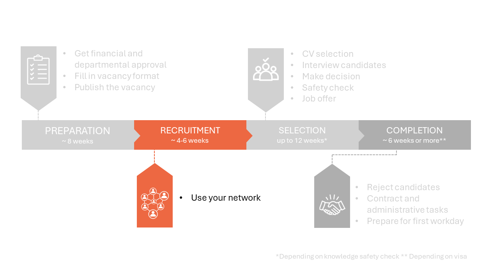

# 2 Recruitment phase



## 2.1 Use your network 

Your vacancy can now be found by job seekers who are actively looking for vacancies and using search terms matching your vacancy text on the specific platforms. This still excludes candidates such as:  

* MSc graduates not actively looking for a job outside of their existing network. 

* Job seekers who don’t have TU Delft on their radar. 

* Job seekers who don’t use LinkedIn or Academic Transfer. 


The so-called “post and pray” strategy is not always sufficient to attract the best candidate. We highly recommend that you always use your network to attract suitable candidates. 

**Use your network**

There are some relatively easy things you can do to boost the exposure and appeal of your vacancy. Invite suitable candidates you know through internships, classes or collaborations to apply. Share the vacancy with your colleagues and ask people for names of potential candidates. Specify that you would appreciate people sharing the vacancy with possible candidates or send you the names of qualifying Master’s graduates. Take the lead in inviting people to apply. You can use both LinkedIn and the TU Delft intranet to find ways to contact these people.

Spread the word about the position when you visit (job) fairs and conferences or give presentations, share research posters or speak to people in your research area during (conference) lunches. Ask your direct colleagues to support you by providing a ready-made slide that they can include in their PowerPoint presentations or an informative banner to include in research posters.  

```{admonition} Using LinkedIn
:class: info, dropdown
**Creating a LinkedIn account**

LinkedIn is an effective social media platform to use for recruitment purposes. If you don’t have a LinkedIn profile, we recommend you create one when you start recruiting. Including a profile picture, sharing your position and field of expertise and selecting TU Delft as your current employer will make you more successful as a recruiter on LinkedIn. Start inviting current and previous colleagues to activate your network of first-degree connections. Invite some of TU Delft’s talent acquisition specialists, as they have large and relevant networks. The magic of social media is that your reach will swiftly increase via your second-degree connections (the connections of your connections). All vacancies submitted for publication online are automatically posted on the TU Delft LinkedIn page. Boost the number of people who read your vacancy by sharing it as a post on your LinkedIn page. Your vacancy will then appear in the timeline, or the homepage, of everyone in your network. Subsequently, it will find its way to your 2nd-degree connections and beyond.  

**Post the vacancy on LinkedIn**

A step-by-step explanation on spreading a vacancy on your LinkedIn account can be found [here](../PhDPostDocs/Appendices/How%20to%20share%20a%20TUD%20vacancy%20on%20LinkedIn%20the%20right%20way.pdf) 

Where you are asked to add a personal note, please write 3 to 6 lines about:  

1. The challenge and impact of the position. 

2. The team or culture.  

3. And add a call to action such as: “Apply now or DM me for more information.” 

Don’t forget to respond to reactions. 
```