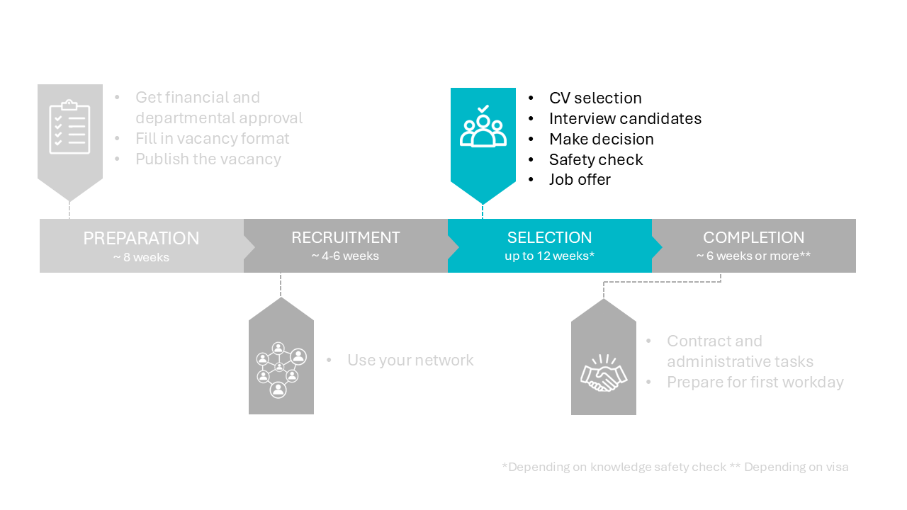

# 3 Selection phase




## 3.1 Selection steps 

The key stages of the selection process are as follows:

1. **The CV review in Talentlink.** During this stage, candidates who do not meet the must-have qualifications are rejected. For the remaining candidates, you provide feedback and comments. It is advisable to discuss your evaluations and considerations with the selection committee.


2. **Screening Interviews:** Conducting brief phone or video interviews can serve as a useful preliminary step before proceeding to formal job interviews.

3. **The full interviews.** Here you check the social and scientific fit of the candidates. 

4. **Candidate selection.** In this stage, you select the preferred candidate. In this stage you rate candidates based on the criteria you defined, and you make reference calls. 


Please use Chapter 3 of [this document](../PhDPostDocs/Appendices/PhD%20Recruitment%20en%20Selection%20Guide%20V1.pdf) as a guide for these steps. Although this guide is written for PhD hiring, it is also very valuable to use for other functions. 

```{admonition} Knowledge safety check
:class: warning, dropdown
Be aware of the **knowledge safety check**! Candidates from or with connections to China, Russia, Belarus, Iran and North Korea should be checked. It is wise to start the knowledge safety check as soon as you have a shortlist of the 3-4 best candidates. How to do it? 

  * Send an email to HR with the candidate(s) name(s) to be checked and the number of the vacancy.  
  * HR will communicate with the safety knowledge department. HR will inform you about the outcome as soon as they have the result.  
  * This check takes approximately 2 weeks and may in extreme cases take up to 10 weeks. 
  * Do not inform the candidates about the knowledge safety check as this information is confidential. 
```


Some important notes: 
* The selection process is done using **Talentlink**. Instructions can be found in a [series of videos](https://www.youtube.com/watch?v=qbWrpIaE6Ac&list=PLvaU1SY38TUVKbhgaSeaaKQhWeHsRUDiZ&index=1)
and in [quick reference charts](https://intranet.tudelft.nl/en/group/guest/-/recruitmentsysteem). Use this system as much as possible and do not store CVs or send CVs by mail. 

* Contact the talent acquisition specialist or the HR advisor if no promising candidates have applied. 

* Regarding the selection committee: the selection is done using the four-eye principle. This requires at least one other person to participate in the selection, ensuring that decisions are impartial and free from bias. It is recommended to include a senior staff member as well as a neutral party who has no vested interest in the hiring decision.

* About the **job interviews**: 

  * The management assistants can help you planning the interviews.  
  * Using an [interview agenda](../PhDPostDocs/Appendices/Interview%20agenda%20-%20PhD%20Recruitment%20en%20Selection%20Guide%20V1%202023.05.docx) is recommended to treat all candidates the same.The interviews can also be split into [educational](../PhDPostDocs/Appendices/JobInterview_HelpingFiles/SPV%20Education%20Questionaire%20-%2020221220.%20-final.docx), 
  [leadership](../PhDPostDocs/Appendices/JobInterview_HelpingFiles/SPV%20Leadership%20questionaire%2020221220%20-%20final.docx) and [research](../PhDPostDocs/Appendices/JobInterview_HelpingFiles/SPV%20Research%20Questionaire%2020221220%20-%20final.docx) sections.


* Check the **English proficiency level (ETV)** of the candidates. An additional test is needed if PhD candidates are non-native speakers and have not followed their masters in English, see [this intranet page](https://intranet.tudelft.nl/en/-/english-language-skills-etv-for-phd-candidates?p_l_back_url=%2Fen%2Fgroup%2Fguest%2Fsearch%3Fq%3Detv) for PhD's and [this intranet page](https://intranet.tudelft.nl/en/-/itav-english-language-skills?p_l_back_url=%2Fen%2Fgroup%2Fguest%2Fsearch%3Fq%3Detv) for other scientific staff.


* Be aware that the process may take longer depending on the nationality of the candidate. The knowledge safety check usually takes 2 weeks and in extreme cases 10 weeks. Acquiring visa usually takes ~4 weeks for EU citizens and 12 weeks for non-EU citizens. 


## 3.2 Job offer 

Once you have selected your preferred candidate and the Knowledge Safety Check yields a positive result, you may proceed to inform the candidate and send a job offer. It is important not to decline your second-choice or "silver" candidate(s) until the job offer has been signed by the preferred candidate.  

First, you contact the candidate to share the positive news. Before doing so, ensure you have gathered the following key details:

* Details about the contract, such as duration, starting date, salary, working hours and contact details for follow-up questions. You can revisit the Vacancy Format for details and contact the HR advisor if any clarification is needed. It is advisable to avoid scheduling the first workday during a holiday period. However, if this cannot be avoided, ensure that support is available for the new employee during their first week.

* Verify the candidate's the English proficiency level (ETV). At this stage, it is strongly recommended to have either a good test result, an English masters degree or a native status by nationality. See also the intranet page [English language skills for PhD candidates](https://intranet.tudelft.nl/en/-/english-language-skills-etv-for-phd-candidates?p_l_back_url=%2Fen%2Fgroup%2Fguest%2Fsearch%3Fq%3Detv) or [English language skills for other scientific staff](https://intranet.tudelft.nl/en/-/itav-english-language-skills?p_l_back_url=%2Fen%2Fgroup%2Fguest%2Fsearch%3Fq%3Detv)

* If you are hiring an international candidate, provide the URL of the website of the Coming to Delft department and a brief introduction of their services.  

* If the candidate is a PhD hire, include an introduction to the Graduate School and the mentor programme.

* In addition, gather information regarding the subsequent steps in the process: the job offer, the contract, and the candidate's first workday. It is advisable to give the candidate an estimated timeline for these steps.


Afterwards, contact the management assistant to prepare the formal job offer. The management assistant will draft the offer based on the details you provide, including the contract duration, start date, salary, working hours, English proficiency (ETV), and relevant contact information. The job offer will be sent to the candidate, with you in the cc.

Finally, remember to update Talentlink. Once the job offer is accepted and all other candidates are rejected, inform the management assistant to close the vacancy in Talentlink. 