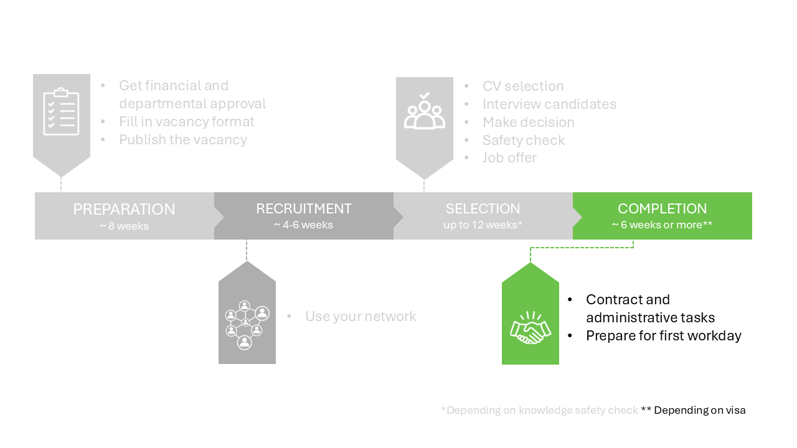

# 4 Completion phase



## 4.1 Rejecting candidates 

Once your preferred candidate has accepted the job offer, it is important to notify the remaining candidates. Candidates who were interviewed should be informed of the decision either by phone or in person. As the vacancy holder, this is your responsibility, and while it may be a challenging task, it is essential that these candidates are treated with respect and professionalism, acknowledging the time and effort they have invested in the application process.

Remember, every interaction with a candidate can influence TU Delft’s reputation as an employer, as well as the reputation of your research department. Careful handling of rejections contributes to maintaining a positive professional image.

**Note:** During the rejection conversation, do not reference the knowledge safety check. The outcome of this check is confidential and should not be shared with candidates. Instead, you can inform them that another candidate was deemed more suitable for the position


```{admonition} Tips for rejection conversations
:class: tip, dropdown

When delivering bad news, please ensure you:  

* Do not postpone it. Get it done before the weekend whenever possible. The candidate will be expecting a follow-up and will feel disappointed if they haven’t heard from you. These candidates will share a bad experience with their peers. This could harm your reputation as an employer within the highly specific network you both operate in.  

* Be as clear as possible. A clear selection strategy will help you to explain why the candidate was not selected for the position. Vague and general feedback like “the other candidate performed better in the interview” or “the other candidate has more relevant experience” can stir strong negative emotions. 

* Stick to sharing actual observations and refrain from definitive conclusions about a candidate’s abilities. You don’t know a candidate’s true potential. Nevertheless, you do have to make a decision based on the impressions collected during the selection process. Don’t say “Your presentation skills are insufficient”. Do say: “During your presentation to the group we saw you struggling to answer questions. In addition, 4 out of the 5 people in the audience, couldn’t reproduce the core of your message.” 

More guidelines on delivering bad news in a positive way:  

1. Start with the announcement: “Hello Tristan, I am calling about your application to the position of PhD candidate. Is this a good time to talk?”  

2. Share the message. Be clear, factual and concise. This will reduce the likelihood of a candidate experiencing anger. For example: “Unfortunately, I have bad news. We have decided not to make you an offer for this position. The main reason is…..”  

3. Pause and listen. You may also ask the candidate “How does this makes you feel?” Don’t guess how the candidate feels. When an emotion is shared or visible, acknowledge it. “I can hear that you are disappointed/upset and I understand”.    

4. If a candidate feels sad or disappointed, this is a healthy part of the process of letting expectations go. Allow space for the candidate to regain their balance. Don’t disempower the candidate by feeling sorry for them.   

5. If a candidate feels angry, don’t take anything personally. Stay calm. Anger can be beneficial for the candidate, too. Don’t try to explain your reasoning during the peak of an emotion. Let the candidate know that you understand their reaction and allow them time to process. If a candidate is very upset, guard your boundaries. In this case, you can kindly end the conversation by stating that you will be in touch again the next day to answer any remaining questions. Always follow up on your promise.  

6. Once the peak of the emotion has passed, again offer your fact-based explanation and answer any questions. Don’t alter your initial explanation. Acknowledge any emotions. Sometimes, you will have to repeat your answer several times. 
```


## 4.2 Contract and other administrative tasks 

In this phase between the job offer and the first workday, the management assistants play a significant role. They will manage the MyHR process, send foreign students information about housing, sign up the candidate for the graduate school (if PhD) and arrange a laptop and workplace. 

**MyHR and the contract**

The management assistant follows the workflow in MyHR. MyHR is used to gather the candidate's information and the contract information. It contains steps to obtain approval from several persons. In the end, a contract is made and signed by the candidate. 

Contact the management assistant to start up the MyHR process. They will need information about the candidate in two stages. 

```{admonition} What information is needed for the first stage of MyHR?
:class: info, dropdown

- Initials of first names 
- First names 
- Preferred name (in Dutch: roepnaam) 
- Prefix (e.g. van or de) 
- Last name 
- Gender 
- Date of birth 
- Phone number private 
- E-mail private 
- Organisatorical unit (i.e. name of section or department) 
- Has this person been employed at TU Delft before? 
```

The second step is about the contract details. Discuss the questions with the candidate and give the outcomes to the management assistant

```{admonition} What information is needed for the second stage of MyHR?
:class: info, dropdown

- On which days will the candidate work? 
- On which days is the candidate on campus? Note that the TU Delft policy is to work at least 60% of the time on campus. 
- Enable payroll tax credit (‘loonheffingskorting’)?  
- Does the candidate want the plus or minus variant? More information can be found on [intranet](https://intranet.tudelft.nl/en/-/flexible-working-time) and an overview of the possibilities is given in a [table](../PhDPostDocs/Appendices/Appendix%20Table%20Flexible%20Working%20Hours%20and%20Times%20(1).pdf)
```

The management assistant can also ask other questions regarding the contract details during this stage. Also inform the management assistant if the contract dates have changed since the job offer. The management assistant will also contact the department secretary and HR advisor to check the contract details, after which an automatic flow of approval starts in MyHR.

If you have not heard of the MyHR process for more than a week, you can go to the management assistant to check where the process is currently stuck. They can see at which step action is required and by whom. Contact the person responsible for the current step to continue the process. 

Ultimately, the contract will be made in MyHR and the candidate has to sign it. Congratulations, the candidate is now officially hired!

**When the contract is signed**

When the contract has been signed, the candidate can apply for a visa. A working permit for EU candidates usually takes ~4 weeks. A residence permit for non-EU candidates usually takes 12 weeks.  

The candidate will automatically get emails for their NetID and campus card. 


## 4.3 First workday

The new employee will soon join the team. It is important to consider how you will structure their first day and the initial week. Ensure they receive a warm welcome, including an introduction to key colleagues and a visit to the management assistants.

During the first week, schedule a meeting to take place two weeks before the end of the trial period. This meeting will allow you to review the new employee’s performance. Use this opportunity to provide constructive feedback—highlighting strengths while identifying areas for improvement. If there are serious concerns regarding the employee’s performance, it is advisable to consult the HR Advisor a few weeks prior to the end of the trial period.

Lastly, please ensure that all documents related to the hiring process are deleted for privacy compliance.