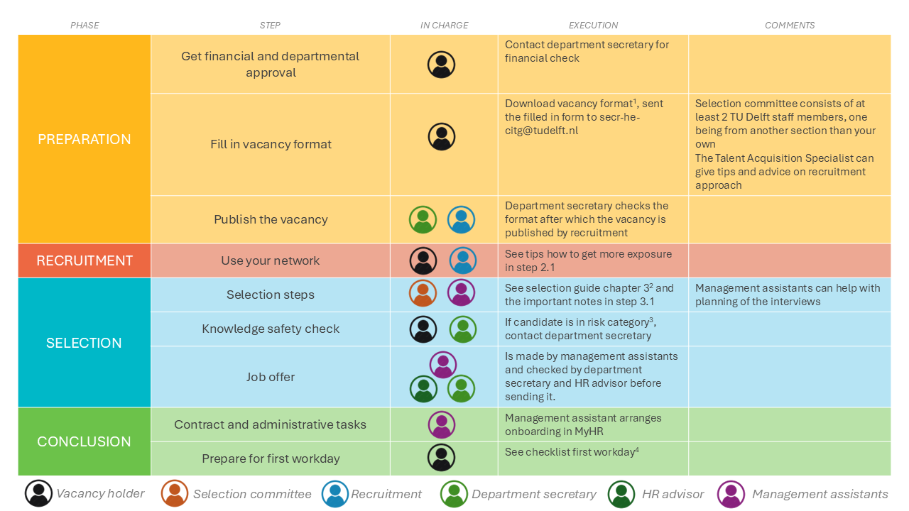

# Summary table

1 The vacancy format is available for [PhDs](./Appendices/Vacancy%20format%20ENG%20-%20October%202024%20format%20PHD.docx) and [PostDocs](./Appendices/Vacancy%20format%20ENG%20-%20October%202024%20format%20POSTDOC.docx).
2 The ‘PhD Recruitment and Selection Guide’ can be found on [this intranet page](https://intranet.tudelft.nl/-/posting-a-vacancy?p_l_back_url=%2Fsearch%3Fq%3Dhiring%2Band%2Bselection%2Bguide).
3 Candidates from or with connections to China, Russia, Belarus, Iran and North Korea should be checked. It is wise to start the knowledge safety check as soon as you have a shortlist of the 3-4 best candidates.
4 The checklist for the first workday can be found [here] YET TO ADD!