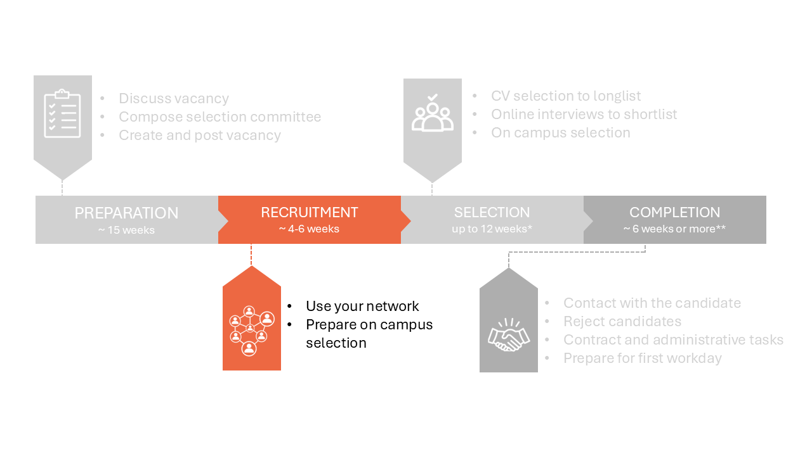
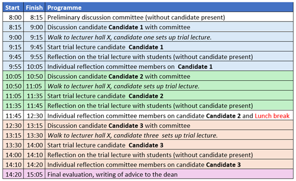
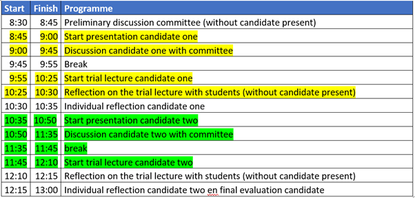

# 2 Recruitment phase

## 2.1 Use your network 

Your vacancy can now be found by job seekers who are actively looking for vacancies and using search terms matching your vacancy text on the specific platforms. This still excludes candidates such as:  

* Scientists not actively looking for a job outside of their existing network. 

* Job seekers who don’t have TU Delft on their radar. 

* Job seekers who don’t use LinkedIn or Academic Transfer. 

The so-called “post and pray” strategy is not always sufficient to attract the best candidate. We highly recommend that you always use your network to attract suitable candidates. 

**Use your network**

There are some relatively easy things you can do to boost the exposure and appeal of your vacancy. Invite suitable candidates you know through conferences, classes or collaborations to apply. Share the vacancy with your colleagues and ask people for names of potential candidates. Specify that you would appreciate people sharing the vacancy with possible candidates or send you the names of qualifying Master’s graduates. Take the lead in inviting people to apply. You can use both LinkedIn and the TU Delft intranet to find ways to contact these people.

Spread the word about the position when you visit (job) fairs and conferences or give presentations, share research posters or speak to people in your research area during (conference) lunches. Ask your direct colleagues to support you by providing a ready-made slide that they can include in their PowerPoint presentations or an informative banner to include in research posters.  

**Creating a LinkedIn account**

LinkedIn is an effective social media platform to use for recruitment purposes. If you don’t have a LinkedIn profile, we recommend you create one when you start recruiting. Including a profile picture, sharing your position and field of expertise and selecting TU Delft as your current employer will make you more successful as a recruiter on LinkedIn. Start inviting current and previous colleagues to activate your network of first-degree connections. Invite some of TU Delft’s talent acquisition specialists, as they have large and relevant networks. The magic of social media is that your reach will swiftly increase via your second-degree connections (the connections of your connections). All vacancies submitted for publication online are automatically posted on the TU Delft LinkedIn page. Boost the number of people who read your vacancy by sharing it as a post on your LinkedIn page. Your vacancy will then appear in the timeline, or the homepage, of everyone in your network. Subsequently, it will find its way to your 2nd-degree connections and beyond.  

**Post the vacancy on LinkedIn**

A step-by-step explanation on spreading a vacancy on your LinkedIn account can be found [here](../PhDPostDocs/Appendices/How%20to%20share%20a%20TUD%20vacancy%20on%20LinkedIn%20the%20right%20way.pdf) 

Where you are asked to add a personal note, please write 3 to 6 lines about:  

1. The challenge and impact of the position. 

2. The team or culture.  

3. And add a call to action such as: “Apply now or DM me for more information.” 

Don’t forget to respond to reactions. 

## 2.2 Prepare on campus selection 

Use the period when the vacancy is open to prepare for the selection phase. 

The main steps of the selection process are: 

1. The CV selection. This selection is done by part of the committee -called small committee- . All candidates are put into the categories accept, reject and doubt. This step results in a longlist of candidates.  

2. Online interviews. This step can be executed if you have more than 3 good candidates. The small committee interviews the longlist of candidates online. The small committee reduces the list of candidates to a shortlist of max. 3 candidates after this step. 

3. The on campus interviews. This step requires the full selection committee and all candidates come to campus. This step results in an advice to the dean. 

The on campus interviews require quite some preparation. Follow the preparation steps below now already for a smooth selection program. 

**Plan the selection moment**

Make sure the selection day is planned and blocked in the agenda of the selection committee. Aim to keep everything in one day for an equal treatment of all candidates. However, you can consider having the final discussion on the next morning to give the selection committee some time to think. 

**Define the selection strategy**

During the day, the candidates have to give a presentation and a trial lecture and they are interviewed. Note that there are set criteria for these positions, see related documents on the right side of [this intranet page](https://intranet.tudelft.nl/-/performance-wp-criteria?p_l_back_url=%2Fsearch%3Fq%3Dwp%2Bcriteria) (set language to NL if not visible) 

Think about which parts of the day will be attended by which part of the selection committee, as a group of 12 people can feel intimidating. For example, you can split the interviews into three separate interviews done by separate parts of the selection committee, the topics being: [education](../HigherFunctions/Appendices/SeparatedInterviews/SPV%20Education%20Questionaire%20-%2020221220.%20-final%20(2).docx), [research](../HigherFunctions/Appendices/SeparatedInterviews/SPV%20Research%20Questionaire%2020221220%20-%20final%20(2).docx) and [valorisation/leadership](../HigherFunctions/Appendices/SeparatedInterviews/SPV%20Leadership%20questionaire%2020221220%20-%20final%20(1).docx). 

Make clear what the presentation and trial lecture should contain. You can use part of the [invitation to the on campus interviews](INVITATION ON CAMPUS) for this step. 

Define what questions you will ask during the interviews. Deviate as little as possible from those questions to ensure equal treatment of all candidates. Example job interview questions can be found [here](../HigherFunctions/Appendices/3.%20%20ExampleQuestons_Interviews.pdf) 

Think about how the grading will be done. An example scoresheet can be found [here](../HigherFunctions/Appendices/2.%20interview_scoresheet_ACT.docx). 

Discuss the selection strategy with some members of the selection committee. 

 

**Make a time schedule**

Make a time schedule for the selection day.  

Some examples of time schedules are shown below 

The selection day consists of the following parts: 

- A preliminary discussion with at least the vacancy holder, selection committee chair and department secretary (strongly advised). During the preliminary discussion you can go through the day, check how tight the time schedule is and discuss the role of the chair.  

- The candidates have to give a presentation and a trial lecture and they are interviewed.  

- Final evaluation round. The result will be and advice from the selection committee to the dean. The dean can ask for a discussion about the advice and will accept or reject the advice. You can use the [template advice to dean](../HigherFunctions/Appendices/ToDean_AdviceOfCommittee.docx) for this. 

Do not forget the practicalities: 

- Ask the management assistant to block 2 rooms close to each other for that day. In one room, the selection committee will come together and discuss the candidates. In the other room, the candidate can prepare for the presentation without the whole committee in the room. 

- Ask the management assistant to arrange coffee and tea, and lunch if the selection process includes lunch. 

- Make sure there is a host to welcome the candidates. A warm welcome gives a positive first impression and can help to put the candidate at ease. 

 

**Inform the selection committee**

The selection committee should get access to the talentlink. 

Inform the selection committee about the selection day. You can use this [template](../HigherFunctions/Appendices/ToSelectionCommittee_OnCampusSelection.docx) to structure your information towards the committee. Do not forget to add the score sheet and the interview questions. This information can be send by mail and can be added to the agenda by the management assistant. 

 

**Inform students for the trial lectures**

Inform students about the trial lectures and make sure there will be enough students. You can send a message via Brightspace and mail by using this [standardized message](../HigherFunctions/Appendices/ToStudents_TrialLectures.docx). The waterbouwdispuut can also help you to get students. You can contact them via Waterbouwdispuut-citg@tudelft.nl . You can find a standard email [here](../HigherFunctions/Appendices/ToWaterbouwDispuut_AskStudentsForTrialLectures.docxToWaterbouwDispuut). 

 

**Informing the candidates**

At this stage, you do not know who will be interviewed during the selection day. However, you can already prepare the invitation for the on campus interviews. An example invitation can be found [here](../HigherFunctions/Appendices/ToCandidates_InvitationOnCampus.docx). 

It is good to know already that the airplane ticket and hotel costs are paid by us if the candidate does not live in The Netherlands. The management assistant can help you with this. 

 