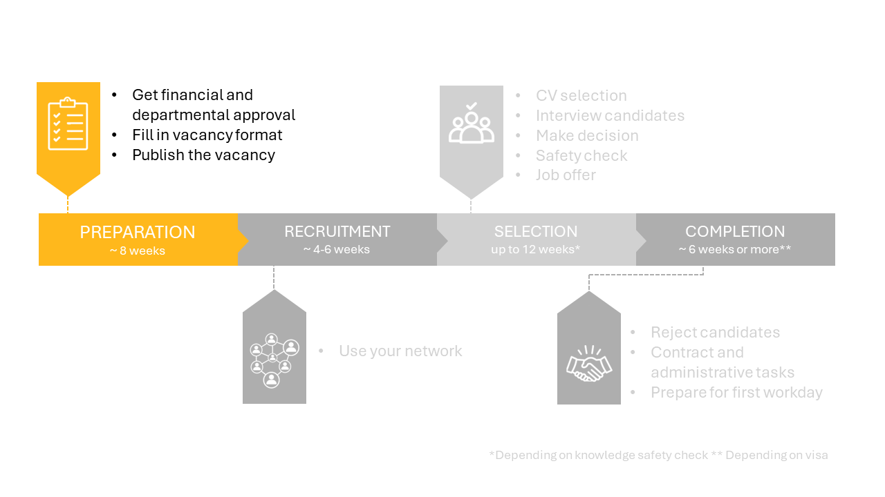

# 1 Preparation phase

## 1.1 Financial and departmenal checks 

First of all, there are two checks: 

* The financial check. If the vacancy is part of a project (2nd/3rd cashflow), the internal budget has to be checked. If the vacancy has a 1st cashflow, contact the Business Controller David Lodowica for the financial check. 
* The departmental check. Inform the department secretary and your section head about the vacancy you want to post. 

If this is your first time being a vacancy holder, also meet with the department secretary and the HR advisor to discuss the practicalities of the hiring process. 

If both checks are complete, you can continue with the next step.

## 1.2 Fill in vacancy format 

Use the [vacancy format](../PhDPostDocs/Appendices/Vacancy%20Format%201.7%20-%20ENG%20-%20Version%2017-05-2021.docx) to gather the required information for the vacancy.

Some notes regarding the vacancy format:
* Contact the department secretary to discuss the UFO profile, the conditions of employment and the vacancy text. 
* The vacancy text can be written using the [vacancy writing guide](../PhDPostDocs/Appendices/Guide%20to%20creating%20recruitment%20text%20for%20scientific%20staff%20-%20Jan%202021.pdf) . As some have noted, the format does not handle comments well, so you can consider making and shaping the vacancy text in a separate word document first. Examples of vacancy texts can be found for PhD functions 
[1](../PhDPostDocs/Appendices/ExamplesVacancyTexts/PhD%20Position%20Decentralised%20Machine%20Learning.docx)
[2](../PhDPostDocs/Appendices/ExamplesVacancyTexts/PhD%20Position%20Modelling%20of%20Regional%20Criminal%20Vulnerability%20and%20Supply%20Chains.docx)
[3](../PhDPostDocs/Appendices/ExamplesVacancyTexts/PhD%20Position%20Spread%20in%20Networks.docx)
[4](../PhDPostDocs/Appendices/ExamplesVacancyTexts/PhD%20Positions%20in%20Thermoplastic%20Composites.docx)
and for Postdoc functions
[1](../PhDPostDocs/Appendices/ExamplesVacancyTexts/Postdoc%20Damping%20of%20Critical%20Electrical%20Oscillatory%20Phenomena.docx)
[2](../PhDPostDocs/Appendices/ExamplesVacancyTexts/Postdoc%20Ethical%20Impact%20of%20Technology%20on%20Society.docx)
[3](../PhDPostDocs/Appendices/ExamplesVacancyTexts/Postdoc%20Partnerschap%20met%20omwonenden%20in%20bouwprocessen.docx)
<!-- source (https://sharepoint.tudelft.nl/misc/medewerkersportaal/_layouts/15/start.aspx#/SitePages/HR%20Vacatureteksten.aspx)  -->
* Some extra tips regarding the requirements formulation and selection strategy can be found in [this document](../PhDPostDocs/Appendices/7%20Tips%20for%20crafting%20a%20Selection%20Strategy.pdf)
* The Talent Acquisition Specialist of the faculty is Avital Fishman. 
* The cash flow is 1 for direct employees and 2/3 for project employees. 
* The standard time for a vacancy posting to stay active is 4-6 weeks. Contact Dept-Chair-HE@tudelft.nl if you would like to deviate from this.  
* A reasonable start date will be six months from the moment you start the vacancy process. Please be aware that the visa arrangement and the safety check may take weeks for NON-EU candidates.

**Selection committee**

It is good practice to form the selection committee in this step. In case of a PhD and Postdoc positions, we use the 4-eye principle in the selection steps, meaning you select together with at least one other person. This is done to avoid biased decisions and blind spots. Try to include a senior staff member and someone neutral, who doesn’t have a vested interest in the hire. 

## 1.3 Send vacancy format to recruitment 

As soon as the financial check and department secretary have approved the vacancy and the vacancy form has been completed, you can send the vacancy form to recruitment: Recruitment-CITG@tudelft.nl 

After submitting your vacancy, it will appear on: 

* TU Delft's internal (intranet) vacancy page 
* TU Delft's external vacancy page 
* Academic Transfer 
* TU Delft's LinkedIn job page 