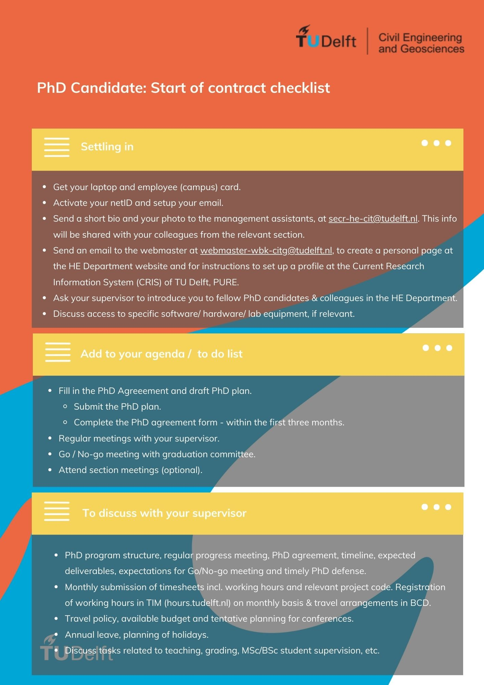
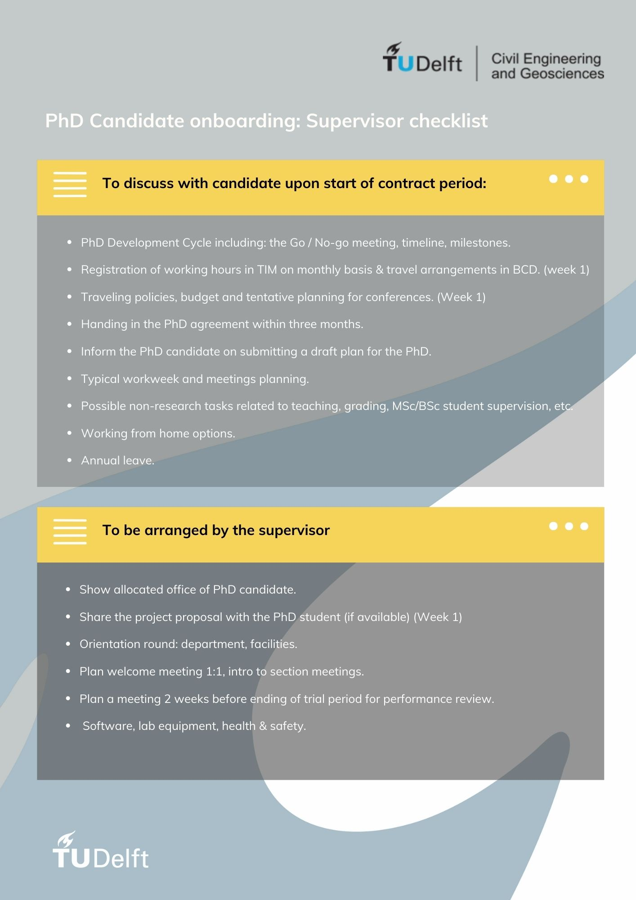
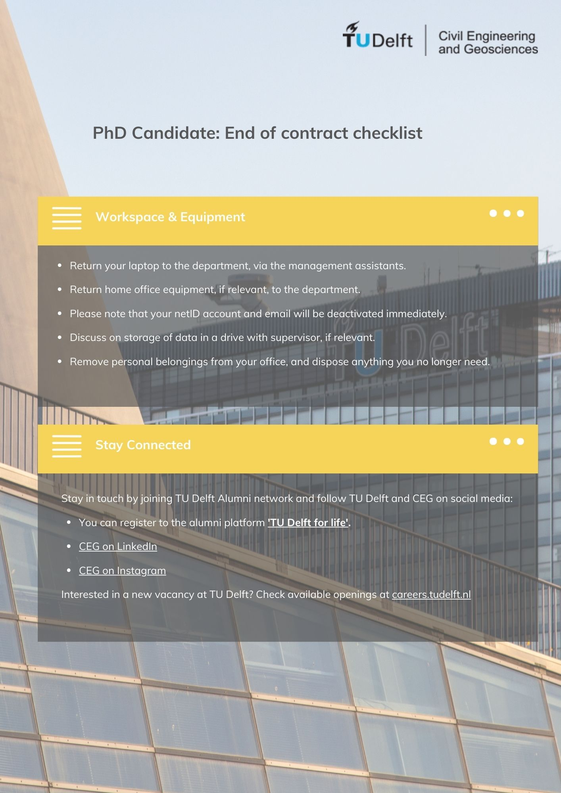

# Information for PhDs 

Below you can find onoarding and end-of-contract checklists for PhD candidates and supervisors.

- PhD candidate onboarding checklist. [Download here](./Appendices/candidate_checklist.pdf)
  The pdf file with candidate's checklist corresponds to the image shown below.
  
   
   
   
- Onboarding checklist for supervisor. [Download here](./Appendices/supervisor_checklist.pdf) <!-- Note: this file is also referenced in the hiring of PhD/Postdocs, step 4.2 -->
  The pdf file with supervisor's checklist corresponds to the image shown below.
  
   
   
   
- PhD Candidate: Useful info, services and links. [Download here](./Appendices/phd_useful_info.pdf)
   
   
   
- End of contract checklist. [Download here](./Appendices/offboarding_checklist.pdf)
  The pdf file including the offboarding checklist corresponds to the image shown below.
  
  
   
  

