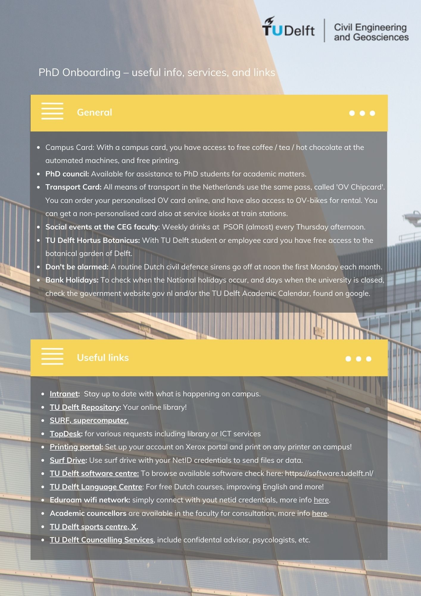

# Information for PhDs 

### PhD defence guidelines
The budget guidelines for PhD defences can be found in [this pdf file](./Appendices/PhD_Defence_Budget_Guidelines–Hydraulic_Engineering_01012025.pdf) 

### Onboarding and end-of-contract checklists

Below you can find onboarding and end-of-contract checklists for PhD candidates and supervisors.

- PhD candidate onboarding checklist. [Download here](./Appendices/candidate_checklist.pdf)    
  The pdf file with candidate's checklist corresponds to the image shown below.   
   
  
   
   
   
- Onboarding checklist for supervisor. [Download here](./Appendices/supervisor_checklist.pdf)    
  The pdf file with supervisor's checklist corresponds to the image shown below.  
   
  
  <!-- Note: this file is also referenced in the hiring of PhD/Postdocs, step 4.2 -->
   
   
   
- PhD Candidate: Useful info, services and links. [Download here](./Appendices/phd_useful_info.pdf)
  The pdf file with useful info and links corresponds to the image shown below, but please notice that links are clickable only at the PDF version.  
   
  
   
   
   
-  The pdf file including the offboarding checklist corresponds to the image shown below.  
   
  
   
   
   
-  Below the pdf file for the Procedure for terminating the PhD trajectory. It concerns operationalisation and steps to take when promotors or PhD candidates want to stop. These are additional activities on top of any HR-related requirements. Detailed instructions can also be found on the graduate school webpage, "supervisor situations," in related documents.
  [Download here](././Appendices/Termination_Proceduresituatie123.pdf)   
   
   
   
-  The file including Caterer' Order Form, for PhD Defence Arrangements [Download here](./Appendices/Caterer's%20Order%20Form%20-%20PhD%20Defence%20Arrangements%20TU%20Delft%202024-2025.xlsx)   
    
   

