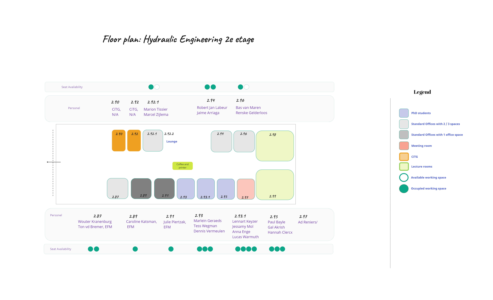
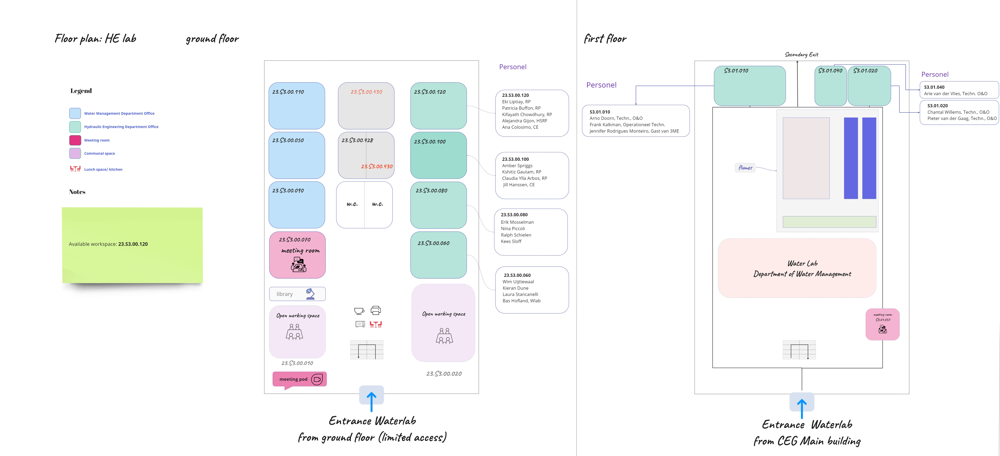

# Floor Plans

In this page you can find the floor plans of the HE Department with the relevant offices in the 2nd and 3rd Floor of the Civil Engineering and Geosciences Building and the Hydraulic Engineering Laboratory.

  

_________________________________________________________________________

**CEG Building 2nd Floor**

  

- [Floor Plan Second Floor (PDF)](../pdfs/2nd_floor.pdf) 
_________________________________________________________________________

**CEG Building 3rd Floor** 

  

  
- [Floor Plan Third Floor (PDF)](../pdfs/3rd_floor.pdf)

_________________________________________________________________________

  
**HE Laboratory**

  

- [HE Lab Floorplan (PDF)](../pdfs/waterlab.pdf)