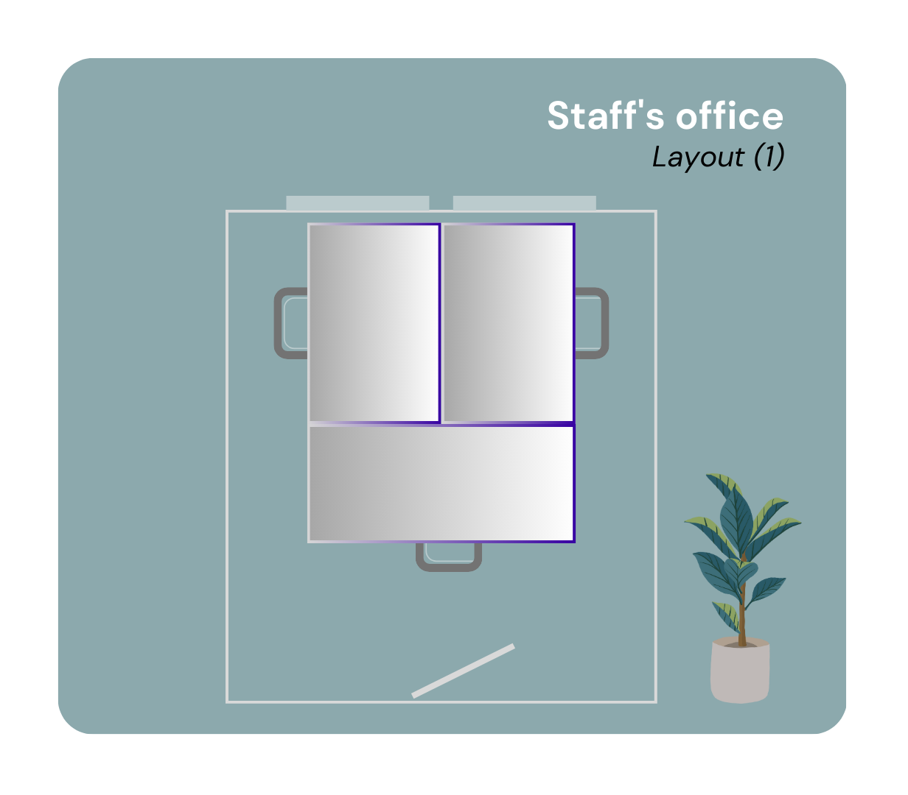
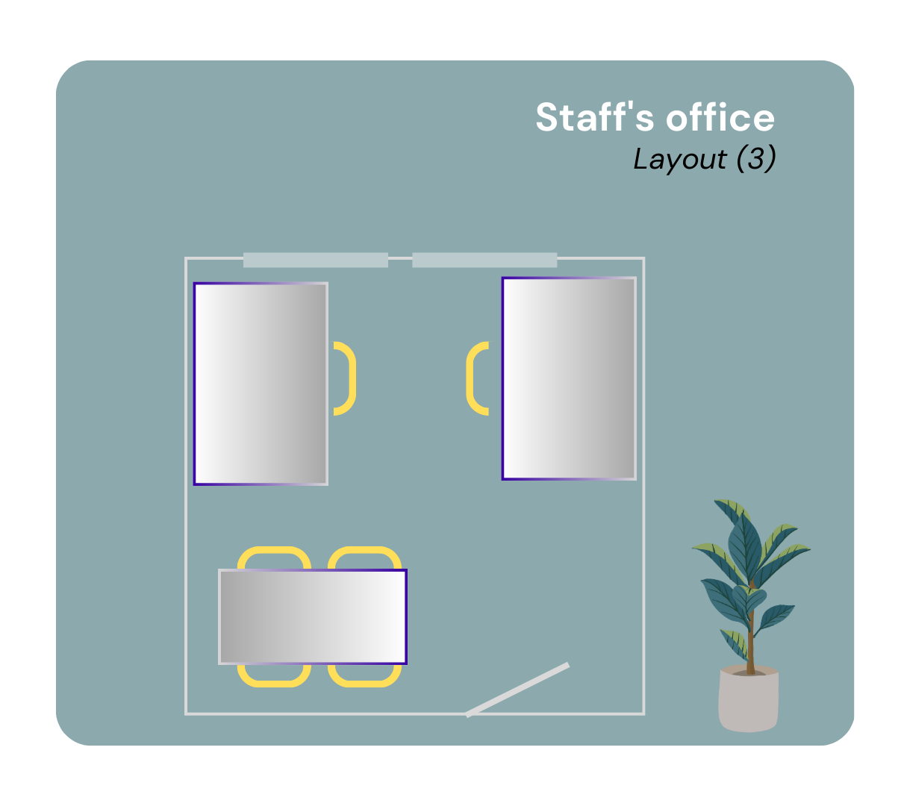
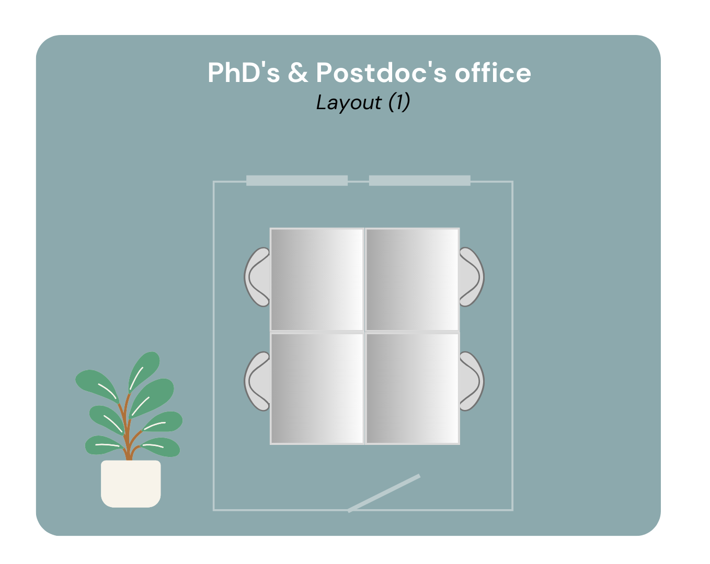
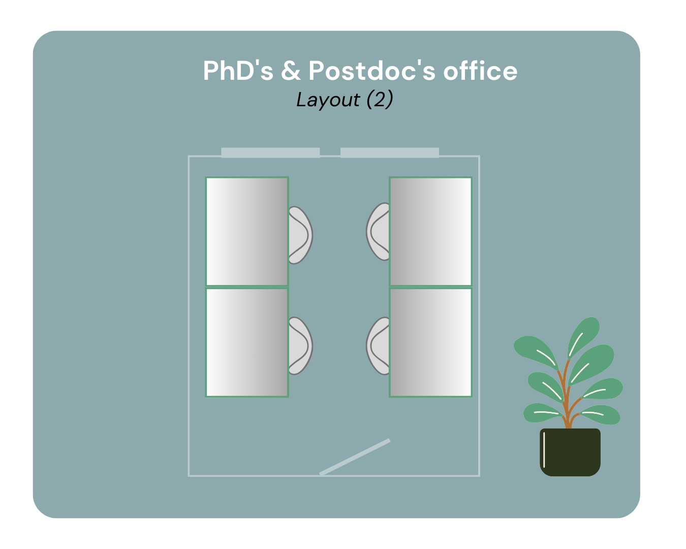
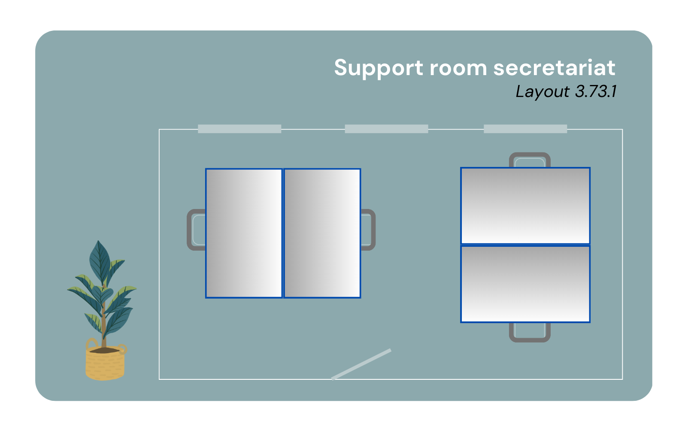

# Office Types

Types of offices within the HE Department for visiting and permanent staff:

- Flex Rooms: 3.38, 3.81 and 3.93
- PhD's / Postdoc's Offices ( 2  layouts)
- Standard office for permanent staff ( 4 layouts)
- Office for senior staff member (1 layout)
  
____________________________________________
  Additional Rooms:

  - Secretariat Room  3.73.1
  - HE Support Room 3.77.1
  - Management Assistants Room [tbc]
____________________________________________

The following layouts are available for permanent or temporary employees of the HE Department. 

|  |  |
|:-----------------------------------------------------------:|:------------------------------------------------------------:|
| **Staff Office Layout I**                                   | **Staff Office Layout II**                                   |

|  |  |
|:--------------------------------------------------------------:|:-------------------------------------------------------------:|
| **Staff Office Layout III**                                    | **Staff Office Layout IV**                                   |

|  |  |
|:--------------------------------------------------:|:---------------------------------------------------:|
| **PhD Office Layout I**                             | **PhD Office Layout II**                            |

|  |  |
|:---------------------------------------------------------------:|:---------------------------------------------------------------------:|
| **Flex Office Layout I**                                       | **Flex Office Layout II**                                            |

|  |  |
|:--------------------------------------------------------------------:|:-------------------------------------------------------------------------------:|
| **Senior Faculty Member Office**                                     | **HE Support Secretariat**                                                     |

**Meeting Rooms**

Available Meeting Rooms in 3rd Floor: 
- 3.47
- 3.57
- 3.79
Note: For up to 4 people, smaller rooms next to lift D are available, noted as Exam room 1 & 2 in the floor plan

Available Meeting Rooms in 2nd Floor: 
- 2.97
  
Available Equipment in the meeting rooms: 
- Display Screen and Camera Set up for online meetings
- Flip chart or white board
- Meeting rooms can have either standing tables or standard tables and seats.

**Meeting Rooms Bookings:**
- Booking of standard meeting rooms is posible by permanent employees.
- To book one of the faculty meeting rooms in the second floor, please direct your request to secr-he-citg@tudelft.nl
- To book a lecture room, please contact roosters-citg@tudelft.nl
